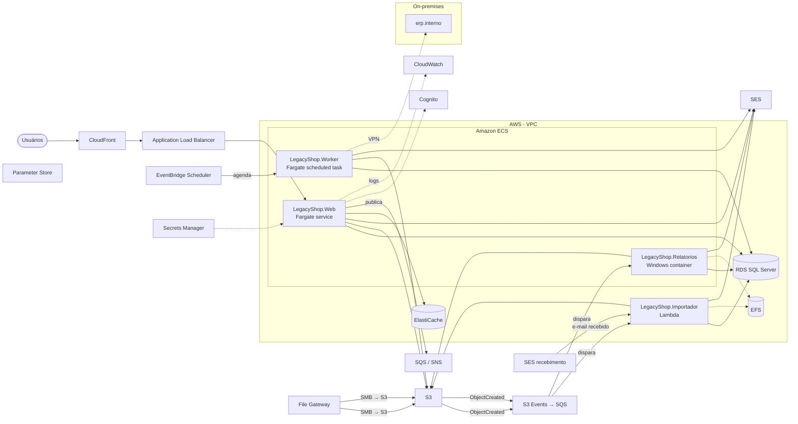

# Migração .NET Framework → .NET 10 — LegacyShop

- **Origem:** `/Users/pablo/Source/dotnet/DotnetMigrator/DotnetMigrator/samples/LegacyShop`
- **Modo:** Análise (nenhum arquivo alterado)
- **Destino:** .NET 10
- **Gerado em:** 06/10/2026 21:57
- **Compatibilidade NuGet verificada:** não (feed: nuget.org (https://api.nuget.org/v3/index.json))
- **Build de verificação:** não executado

## Resumo

| Projeto | Tipo | Origem | Bloqueantes | Atenção | Automático | % automatizado | Build | Modernização | AWS |
|---|---|---|---:|---:|---:|---:|---|---:|---|
| LegacyShop.Web | Web (MVC/Web API) | v4.7.2 | 25 | 25 | 82 | 62% | não executado (análise) | 24 | ECS Fargate |
| LegacyShop.Core | Biblioteca | v4.6.1 | 5 | 9 | 8 | 36% | não executado (análise) | 6 | — |
| LegacyShop.Worker | Windows Service | v4.6.1 | 1 | 11 | 20 | 62% | não executado (análise) | 10 | ECS agendado |
| LegacyShop.Tests | Testes | v4.6.1 | 0 | 0 | 4 | 100% | não executado (análise) | 0 | — |
| LegacyShop.Importador | Console | v4.5 | 0 | 3 | 11 | 79% | não executado (análise) | 7 | Lambda |
| LegacyShop.Relatorios | Console · VB.NET | v4.5 | 1 | 0 | 0 | 0% | não executado (análise) | 5 | ECS Windows |

## Dados acessados (bancos, tabelas e campos)

Bancos, tabelas, procedures e campos que o código acessa, extraídos de SQL em literais C#/VB e arquivos .sql, leitores ADO.NET, chamadas Dapper, modelos EF6/EF Core e EDMX. O banco é resolvido pelas connection strings (nome três partes no SQL > nome da connection string citada no código > banco único do projeto ou de quem o hospeda). Análise estática: tabelas montadas dinamicamente e colunas lidas por índice não aparecem; confira com o DBA antes de migrar os dados.

### LegacyShop (SQL Server) — 2 tabela(s), 0 procedure(s)

| Tabela / procedure | Campos acessados | Operações | Acesso | Projetos | Onde |
|---|---|---|---|---|---|
| **PedidoImportado** | Cliente, Data, Numero, Valor | INSERT | ADO.NET | LegacyShop.Importador | `ImportadorDePedidos.cs:74` |
| **Produto** | Categoria, Descricao, Destaque, Id, Nome, Preco | DELETE, EF (escrita), EF (leitura), SELECT | arquivo .sql, Dapper, EF6 | LegacyShop.Core | `Services/ProdutoService.cs:81; Sql/ConsultaDestaques.sql; Data/ShopContext.cs:13` |

### Relatorios (SQL Server) — 1 tabela(s), 0 procedure(s)

| Tabela / procedure | Campos acessados | Operações | Acesso | Projetos | Onde |
|---|---|---|---|---|---|
| **Vendas** | *, Mes, Produto, Valor | SELECT | ADO.NET | LegacyShop.Relatorios | `GeradorRelatorio.vb:16` |

## Arquitetura alvo (AWS)

LegacyShop tem 6 projeto(s): 1 aplicação web, 1 biblioteca, 1 Windows Service, 1 projeto de testes, 2 consoles. LegacyShop.Web (web): 3 controller(s) MVC e 8 view(s); 2 controller(s) de API; login por Forms Authentication; sessão em memória; upload de arquivos; 1 arquivo(s) Web Forms; acessa SQL Server (LegacyShop), SQL Server (Relatorios); envia e-mail por SMTP; grava arquivos locais; inclui LegacyShop.Core → ECS Fargate (Linux) + ALB. LegacyShop.Worker (serviço): loop com timer; agendador (Quartz); acessa SQL Server (LegacyShop); envia e-mail por SMTP; consome serviços WCF/SOAP; inclui LegacyShop.Core → ECS Fargate (tarefa agendada via EventBridge Scheduler). LegacyShop.Importador (console): lê caixa de e-mail (Microsoft.Exchange.WebServices); processa planilhas/CSV; acessa SQL Server (LegacyShop); envia e-mail por SMTP; grava arquivos locais; inclui LegacyShop.Core → AWS Lambda. LegacyShop.Relatorios (console): VB.NET (não convertido); acessa SQL Server (Relatorios); envia e-mail por SMTP; grava arquivos locais → ECS com containers Windows.

### Hospedagem recomendada

| Projeto | Tipo | Hospedagem | Por quê | Pré-requisitos | Alternativas |
|---|---|---|---|---|---|
| **LegacyShop.Web** (Dockerfile gerado) | Web (MVC/Web API) | **ECS Fargate (Linux) + ALB** | • Aplicação ASP.NET Core sem dependências Windows: container Linux no ECS Fargate atrás de um Application Load Balancer é o padrão de menor operação para o portfólio (mesmo pipeline, mesma observabilidade para todas as aplicações). | • Reescrever 1 arquivo(s) Web Forms (.aspx/.ascx/.master) que não compilam no .NET 10; o restante (MVC/Web API) migra normalmente. • Endpoint /health para o target group do ALB (gerado no Program.cs) e ForwardedHeaders para IP/esquema reais (gerado). • Sessão em ElastiCache (AddStackExchangeRedisCache) em vez de memória. • Anel de chaves do Data Protection persistido fora do container (SSM Parameter Store ou S3+KMS). • Remover estado em coleções estáticas (cada task teria uma cópia). • Arquivos persistentes no S3 (ou volume EFS), não no disco do container. • Logs em stdout (JSON) → CloudWatch Logs. • Segredos e connection strings no Secrets Manager, injetados na task definition; remover as credenciais embutidas no código e rotacioná-las. • Fuso horário e cultura definidos no container (TZ/LANG no Dockerfile gerado) ou código em UTC. | • AWS App Runner — mesma imagem Docker com menos configuração (sem cluster/ALB próprios); menos controle de rede e sem Spot. Bom para aplicações internas pequenas. • AWS Elastic Beanstalk (.NET on Linux) — sem Docker, deploy do publish; plataforma mais antiga, menos padronizável que ECS. |
| **LegacyShop.Core** | Biblioteca | **não publicável (biblioteca/testes)** | • Biblioteca: é empacotada dentro dos projetos que a referenciam; as dependências dela foram consideradas na recomendação deles. | — | — |
| **LegacyShop.Worker** (Dockerfile gerado) | Windows Service | **ECS Fargate (tarefa agendada via EventBridge Scheduler)** | • Processo periódico (timer/agendador): Amazon EventBridge Scheduler dispara uma tarefa ECS Fargate (RunTask) no horário; a task termina ao concluir e não há custo entre execuções. • Pré-requisito: substituir Event Log (log4net EventLogAppender) (itens MOD-WIN-* da modernização). | • Arquivos persistentes no S3 (ou volume EFS), não no disco do container. • Logs em stdout (JSON) → CloudWatch Logs. • Connection strings com autenticação SQL (Integrated Security não funciona no Fargate). • Fuso horário e cultura definidos no container (TZ/LANG no Dockerfile gerado) ou código em UTC. | • ECS Fargate como serviço contínuo (BackgroundService + PeriodicTimer) — mais simples de portar, paga 24x7 e precisa de lock distribuído se escalar. • AWS Lambda agendado pelo EventBridge — se a execução durar menos de 15 min e couber em 10 GB de memória. |
| **LegacyShop.Tests** | Testes | **não publicável (biblioteca/testes)** | • Projeto de testes: roda no pipeline de CI (AWS CodeBuild ou GitHub Actions), não é publicado. | — | — |
| **LegacyShop.Importador** | Console | **AWS Lambda** | • Automação orientada a evento (arquivos, caixa de e-mail), 3 arquivo(s) de código e sem dependências Windows: AWS Lambda executa só quando há trabalho, sem container 24x7 nem agendamento cego. • Gatilhos: arquivos: S3 Event Notifications (ObjectCreated) → SQS → Lambda; pastas de rede viram um bucket via AWS Storage Gateway (File Gateway) ou os parceiros enviam por AWS Transfer Family; e-mail: Amazon SES recebimento (regra → S3 → SQS/Lambda) quando o domínio da caixa puder apontar para a AWS; senão, EventBridge Scheduler disparando a Lambda que consulta a caixa via Microsoft Graph/IMAP. • Limites do Lambda: 15 min por execução, 10 GB de memória, /tmp de até 10 GB; processamento maior que isso vai para a alternativa ECS. • Pré-requisito: substituir compartilhamentos SMB (UNC) (arquivos) (itens MOD-WIN-* da modernização). | • Reescrever o ponto de entrada como handler Lambda (Amazon.Lambda.Core + Amazon.Lambda.SQSEvents/S3Events) ou usar Amazon.Lambda.Annotations; publicar com Amazon.Lambda.Tools ou imagem de container. • Trocar EWS por Microsoft Graph (EWS está sendo bloqueado no Exchange Online) ou mover a caixa para recebimento via SES. • Arquivos persistentes no S3 (ou volume EFS), não no disco do container. • Segredos e connection strings no Secrets Manager, injetados na task definition. • Fuso horário e cultura definidos no container (TZ/LANG no Dockerfile gerado) ou código em UTC. | • Tarefa ECS Fargate agendada (EventBridge Scheduler) — mantém o Main() como está (sem reescrever para handler); escolha se a execução puder passar de 15 min ou se preferir uniformidade com as demais aplicações. • Worker ECS Fargate contínuo consumindo SQS — para volume alto e constante. |
| **LegacyShop.Relatorios** | Console | **ECS com containers Windows** ⚠ exige Windows | • Depende de componentes exclusivos do Windows: componentes COM (COMReference &lt;COMReference Include="Microsoft.Office.Interop.Excel"&gt;   &lt;Guid&gt;{00020813-0000-0000-C000-000000000046}&lt;/Guid&gt;   &lt;VersionMajor&gt;1&lt;/VersionMajor&gt;   &lt;VersionMinor&gt;9&lt;/VersionMinor&gt;   &lt;WrapperTool&gt;primary&lt;/WrapperTool&gt; &lt;/COMReference&gt;); Office Interop (GeradorRelatorio.vb:4). Container Windows no ECS (ou EC2 Windows se precisar de sessão interativa). | • Projeto VB.NET: converter para SDK-style/net10.0 (Upgrade Assistant) ou para C# (CodeConverter) antes de qualquer deploy; o Migrator não gerou a cópia migrada. • Arquivos persistentes no S3 (ou volume EFS), não no disco do container. • Segredos e connection strings no Secrets Manager, injetados na task definition. • Fuso horário e cultura definidos no container (TZ/LANG no Dockerfile gerado) ou código em UTC. | • ECS Fargate (Linux) após remover as dependências Windows. |

### Serviços

| Serviço AWS | Papel | Substitui | Por quê | Usado por | Necessidade |
|---|---|---|---|---|---|
| **Amazon VPC (subnets privadas, NAT Gateway, VPC endpoints)** | Rede | rede do datacenter | Tasks em subnets privadas; VPC endpoints para S3, ECR, CloudWatch e Secrets Manager evitam custo de NAT e saída pela internet. _NAT Gateway é um custo fixo relevante: use endpoints para serviços AWS._ |  | obrigatório |
| **Application Load Balancer + AWS Certificate Manager** | Entrada HTTP/HTTPS, TLS, health checks, roteamento por host/caminho | IIS bindings / certificados no servidor | Termina TLS com certificados gratuitos do ACM, distribui entre tasks e remove tasks sem saúde (/health). Um ALB pode servir várias aplicações por host header. _Habilite access logs no S3 e, para aplicações públicas, AWS WAF (regras gerenciadas OWASP)._ | LegacyShop.Web | obrigatório |
| **Amazon ECS on AWS Fargate** | Execução dos containers (serviços web, workers e tarefas agendadas) | IIS / Windows Services em servidores | Sem servidores para administrar; deploy por imagem; auto scaling por CPU/fila/requisições. Um cluster por ambiente, um serviço por aplicação. _Projetos com dependências Windows usam containers Windows (Fargate Windows ou EC2 launch type), ~2x o custo do Linux._ | LegacyShop.Importador, LegacyShop.Relatorios, LegacyShop.Web, LegacyShop.Worker | obrigatório |
| **AWS Lambda (.NET)** | Automações orientadas a evento (arquivos, e-mails, filas) | Windows Services / consoles agendados que ficam ociosos a maior parte do tempo | Executa só quando há trabalho e cobra por milissegundo; gatilhos nativos de S3, SQS, SES e EventBridge; escala por evento sem configurar auto scaling. _Runtime gerenciado .NET (ou imagem de container quando o .NET 10 ainda não estiver no runtime gerenciado); empacote com Amazon.Lambda.Tools. Configure DLQ e timeout por função._ | LegacyShop.Importador | obrigatório |
| **Amazon ECR** | Registro das imagens Docker | pastas de publish / MSDeploy | Imagens versionadas por commit, scan de vulnerabilidades (Inspector) e lifecycle policy. | LegacyShop.Importador, LegacyShop.Relatorios, LegacyShop.Web, LegacyShop.Worker | obrigatório |
| **Amazon S3 Event Notifications → SQS** | Gatilho das automações de arquivo | FileSystemWatcher / varredura periódica de pasta | Cada arquivo novo no bucket gera um evento; a fila garante retry e DLQ e dispara a Lambda ou escala o worker. Elimina o polling e a janela em que o arquivo ainda está sendo copiado. _Use prefixos por tipo de arquivo e um prefixo 'processados/' para mover após o sucesso._ | LegacyShop.Importador, LegacyShop.Relatorios | obrigatório |
| **Amazon EventBridge Scheduler** | Agendamento de tarefas (cron) que disparam tarefas ECS ou Lambdas | Timers em Windows Services / Quartz / Task Scheduler | Cron gerenciado com retry, DLQ e histórico; a task roda só quando necessário. _Para jobs que precisam de lock, o Scheduler já garante uma execução por horário._ | LegacyShop.Worker | obrigatório |
| **Amazon RDS for SQL Server** | Banco de dados (LegacyShop, Relatorios); 3 tabela(s) acessadas: Produto, PedidoImportado, Vendas — detalhes na seção 'Dados acessados' | SQL Server em (LocalDb)\MSSQLLocalDB, srv-sql01 | Mesmo engine, backups automáticos, Multi-AZ e patching gerenciado; restore nativo a partir de .bak no S3 para migrar os dados. _Licença inclusa (Standard/Enterprise/Web/Express). Integrated Security exige AWS Managed Microsoft AD; prefira autenticação SQL + Secrets Manager. Para reduzir licenciamento a longo prazo: Aurora PostgreSQL com Babelfish._ | LegacyShop.Web, LegacyShop.Worker | obrigatório |
| **Amazon ElastiCache (Valkey / Redis OSS)** | Sessão distribuída, cache compartilhado e backplane do SignalR | sessão InProc, HttpRuntime.Cache/MemoryCache, coleções estáticas | Permite mais de uma task por serviço sem perder sessão nem divergir cache; ElastiCache Serverless cobra por uso. _Pacotes: Microsoft.Extensions.Caching.StackExchangeRedis, Microsoft.AspNetCore.SignalR.StackExchangeRedis._ | LegacyShop.Web | obrigatório |
| **Amazon S3** | Arquivos (uploads, exportações, App_Data, logs de acesso) | pastas locais/rede: C:\Exportacao, C:\Exportacao\Estoque, arquivos, C:\Importacao\Processados | Durável e compartilhado entre instâncias; URLs pré-assinadas para upload/download direto; eventos S3 disparam processamento (SQS/Lambda). Lifecycle para Glacier reduz custo de histórico. _Bloqueie acesso público, habilite versionamento e criptografia SSE-S3/KMS. Acesso via task role (sem chaves)._ | LegacyShop.Importador, LegacyShop.Relatorios, LegacyShop.Web, LegacyShop.Worker | obrigatório |
| **Amazon SES** | Envio de e-mail transacional | SMTP smtp.exemplo.com.br | Endpoint SMTP compatível (porta 587) ou API; métricas de bounce/complaint; DKIM gerenciado. _Verifique domínio e saia do sandbox antes do go-live._ | LegacyShop.Importador, LegacyShop.Relatorios, LegacyShop.Web, LegacyShop.Worker | obrigatório |
| **AWS Secrets Manager** | Senhas de banco, chaves de API, credenciais SMTP | senhas no web.config/app.config e credenciais embutidas no código | Injeção na task definition (valueFrom) sem passar pela imagem; rotação automática para RDS. _Combine com IAM task roles: nenhuma access key no código._ | LegacyShop.Importador, LegacyShop.Relatorios, LegacyShop.Web, LegacyShop.Worker | obrigatório |
| **AWS Systems Manager Parameter Store** | Configuração por ambiente e anel de chaves do Data Protection | machineKey / appSettings por servidor | Configuração centralizada carregada no IConfiguration (Amazon.Extensions.Configuration.SystemsManager); PersistKeysToAWSSystemsManager mantém cookies válidos entre tasks e deploys. | LegacyShop.Web | obrigatório |
| **Amazon CloudWatch (Logs, Metrics, Alarms, Container Insights)** | Logs, métricas e alarmes | arquivos de log / Event Log / contadores de desempenho | stdout dos containers vai direto ao CloudWatch Logs; Container Insights dá CPU/memória por serviço; alarmes acionam SNS/auto scaling. _Defina retenção (ex.: 30 dias) para controlar custo. Traces distribuídos: AWS X-Ray via ADOT._ | LegacyShop.Importador, LegacyShop.Relatorios, LegacyShop.Web, LegacyShop.Worker | obrigatório |
| **AWS Site-to-Site VPN ou Direct Connect + Route 53 Resolver** | Conectividade com a rede on-premises | acesso direto na LAN a srv-sql01, erp.interno | Integrações internas (ERP, WCF, serviços) continuam on-premises durante e após a migração; o DNS interno precisa ser resolvível da VPC. _Direct Connect para latência previsível se o volume for alto; VPN para começar._ | LegacyShop.Importador, LegacyShop.Relatorios, LegacyShop.Web, LegacyShop.Worker | obrigatório |
| **GitHub Actions / AWS CodePipeline + CodeBuild** | Build da imagem, testes, push ao ECR e deploy no ECS | publicação manual / MSDeploy | Pipeline padronizado para as aplicações do portfólio; deploy rolling ou blue/green (CodeDeploy) com rollback automático por alarme. _Infraestrutura como código: AWS CDK (C#) ou Terraform; um template reutilizado por aplicação._ | LegacyShop.Importador, LegacyShop.Relatorios, LegacyShop.Web, LegacyShop.Worker | obrigatório |
| **Amazon CloudFront** | CDN para conteúdo estático e arquivos | arquivos servidos pelo IIS | Cache de wwwroot e de objetos do S3 na borda; reduz carga nas tasks. | LegacyShop.Web | recomendado |
| **Amazon Route 53** | DNS | DNS interno / registros apontando para servidores | Registros alias para o ALB; roteamento ponderado permite cutover gradual e rollback. |  | recomendado |
| **Amazon SES (recebimento) → S3 → SQS/Lambda** | Entrada de e-mails para as automações | leitura de caixa postal (Microsoft.Exchange.WebServices) | Com um (sub)domínio apontado para o SES, cada e-mail recebido vira um objeto no S3 e um evento: sem polling, sem credenciais de caixa, sem EWS. Anexos ficam no S3 prontos para processar. _Se a caixa precisar continuar no Exchange Online/M365, use Microsoft Graph (EWS está sendo desligado) a partir de uma Lambda agendada pelo EventBridge, com o segredo do app no Secrets Manager; ou configure uma regra de encaminhamento da caixa para o endereço do SES._ | LegacyShop.Importador | recomendado |
| **Amazon SQS (+ SNS para fan-out)** | Filas entre a aplicação web e os workers | chamadas diretas / tabelas usadas como fila | Desacopla a web dos workers: a web enfileira, o worker processa; permite escalar e reprocessar com DLQ. _Biblioteca: AWS.Messaging (AWS Message Processing Framework for .NET)._ | LegacyShop.Importador, LegacyShop.Relatorios, LegacyShop.Web, LegacyShop.Worker | recomendado |
| **Amazon EFS (ou FSx for Windows File Server)** | Sistema de arquivos compartilhado montado nas tasks | compartilhamentos SMB (UNC) | Alternativa de lift-and-shift quando o código espera um caminho de pasta; FSx for Windows se outros sistemas Windows também acessam a pasta. | LegacyShop.Importador, LegacyShop.Relatorios | recomendado |
| **AWS Storage Gateway (File Gateway)** | Compartilhamento SMB/NFS on-premises com os arquivos gravados no S3 | pastas de rede onde outros sistemas depositam arquivos | Os sistemas que hoje gravam em \\servidor\pasta continuam gravando numa pasta; o File Gateway envia ao S3 e o evento dispara a automação. Permite migrar a automação sem mudar quem produz os arquivos. _Alternativa quando os produtores podem mudar: gravar direto no S3 com AWS CLI/SDK ou enviar por Transfer Family._ | LegacyShop.Importador, LegacyShop.Relatorios | recomendado |
| **Amazon Cognito** | Login, MFA, recuperação de senha, federação | Forms Authentication / Membership / Identity 2 | Terceiriza o ciclo de vida de usuários; a aplicação só valida tokens/cookies OIDC. Opcional: ASP.NET Core Identity no RDS mantém tudo na aplicação. | LegacyShop.Web | recomendado |

### Diagrama

### Plano de migração

1. Fundação (uma vez para o portfólio): landing zone/contas, VPC com subnets privadas e VPC endpoints, cluster ECS, ECR, CloudWatch, Secrets Manager/Parameter Store, pipeline de CI/CD e templates de IaC (CDK/Terraform). Conectividade híbrida (VPN/Direct Connect) e Route 53 Resolver para o DNS interno.
2. Dados: provisionar o RDS, migrar com restore nativo (.bak via S3) ou AWS DMS com replicação contínua; trocar Integrated Security por autenticação SQL com segredo no Secrets Manager; validar Encrypt/TLS e collation.
3. Aplicação: compilar a saída do Migrator, resolver os itens bloqueantes do inventário, construir a imagem com o Dockerfile gerado, externalizar estado (sessão → ElastiCache, Data Protection → SSM, arquivos → S3), logs em stdout, segredos via task definition. Rodar os testes no pipeline.
4. Integrações: leitura de caixa postal → SES recebimento ou Microsoft Graph (EWS em desligamento), SMTP → SES, timers → EventBridge Scheduler, arquivos → S3; testes de contrato com os sistemas on-premises via VPN.
5. Cutover: deploy em homologação na AWS com dados reais (cópia), testes de carga para dimensionar as tasks, Route 53 com roteamento ponderado (10% → 100%), alarmes e runbook de rollback (voltar o peso do DNS).
6. Modernização contínua (pós-migração): itens de Licença/Modernização desta lista (AutoMapper/MediatR, EF Core, System.Text.Json), redução de licença de SQL Server (Aurora PostgreSQL/Babelfish) e remoção das dependências Windows restantes para padronizar tudo em Fargate Linux.

### Riscos

- LegacyShop.Relatorios exige Windows (componentes COM (COMReference &lt;COMReference Include="Microsoft.Office.Interop.Excel"&gt;   &lt;Guid&gt;{00020813-0000-0000-C000-000000000046}&lt;/Guid&gt;   &lt;VersionMajor&gt;1&lt;/VersionMajor&gt;   &lt;VersionMinor&gt;9&lt;/VersionMinor&gt;   &lt;WrapperTool&gt;primary&lt;/WrapperTool&gt; &lt;/COMReference&gt;); Office Interop (GeradorRelatorio.vb:4)): custo ~2x e pipeline separado até remover a dependência.
- Connection strings com Integrated Security: o Fargate não participa do domínio; é preciso trocar para autenticação SQL (ou Managed AD) antes do primeiro deploy.
- Fuso horário e cultura: containers rodam em UTC e, sem LANG, em cultura invariante; datas e formatação de números mudam. O Dockerfile gerado define TZ/LANG, mas o código deveria usar UTC e culturas explícitas.
- Integrações on-premises via VPN adicionam latência (10-40 ms por chamada); chamadas em loop (N+1) que eram imperceptíveis na LAN podem ficar lentas. Meça com X-Ray e agrupe chamadas.
- Estado em memória (sessão/coleções estáticas): qualquer teste com uma única task passa e falha em produção com duas. Teste com desired count ≥ 2 desde homologação.
- Uploads grandes/requisições longas: ALB idle timeout de 60 s e memória da task; usar URLs pré-assinadas do S3 e processamento assíncrono.
- Segredos em texto claro (inclusive embutidos no código C#) iriam parar na imagem Docker e no repositório: bloqueie no pipeline (git-secrets/trufflehog), mova para o Secrets Manager antes do primeiro build e rotacione o que já vazou.
- Bibliotecas que viraram pagas (2): decidir entre pagar, congelar versão ou substituir antes de escalar para as demais aplicações do portfólio.

### Custo

- Fargate Linux: comece com 0,5 vCPU / 1 GB por task e 2 tasks por serviço web (alta disponibilidade); Fargate Spot para workers tolerantes a interrupção reduz ~70%.
- Containers/EC2 Windows: licença do Windows embutida (~2x o preço do Linux), sem Spot no Fargate Windows e imagens de 5-10 GB (deploys lentos). Remover as dependências Windows é a maior alavanca de custo.
- RDS for SQL Server: a licença inclusa domina o custo (Standard ≈ 2-3x o preço de um RDS PostgreSQL equivalente). Vários bancos pequenos cabem numa instância; Express é gratuito em licença até 10 GB por banco; Babelfish for Aurora PostgreSQL elimina a licença mantendo T-SQL.
- Tarefas agendadas pagam só o tempo de execução (em vez de um Windows Service 24x7).
- Lambda: automações que processam poucos milhares de eventos por mês costumam caber no nível gratuito (1 M de invocações e 400 mil GB-s); o custo relevante passa a ser o S3/SES e o RDS.
- NAT Gateway tem custo fixo por hora + por GB; VPC endpoints para S3/ECR/CloudWatch/Secrets Manager evitam a maior parte do tráfego.
- CloudWatch Logs: defina retenção e evite logs em nível Debug em produção; o custo de ingestão (por GB) surpreende em aplicações verbosas.
- ElastiCache Serverless cobra por GB-hora e requisições — adequado para sessão/cache de aplicações pequenas; um único cluster pode servir várias aplicações (separe por prefixo/DB).

## Modernização (52)

Sugestões que não bloqueiam a compilação: bibliotecas que passaram a ser pagas ou foram descontinuadas, código C# que compila mas muda de comportamento no .NET 10/Linux, e adaptações para a AWS. Detalhes completos em `modernization.csv` e na aba Modernização do `inventory.xlsx`.

| Projeto | Tipo | Impacto | Esforço | Item | Proposta | Serviço AWS |
|---|---|---|---|---|---|---|
| LegacyShop.Web | Cloud (AWS) | Alto | Baixo | **[MOD-ARCH-DATAPROTECTION] Chaves do Data Protection compartilhadas entre instâncias** _Cookies de autenticação, antiforgery e sessão são protegidos pelo Data Protection; cada container gera chaves próprias (o equivalente ao machineKey do web.config), então um cookie emitido por uma task é inválido na outra e todos são invalidados a cada deploy._ `Web.config, authentication mode=Forms` | Persista o anel de chaves fora do container: pacote Amazon.AspNetCore.DataProtection.SSM (PersistKeysToAWSSystemsManager) ou S3 + KMS (AspNetCore.DataProtection.Aws.S3), e defina SetApplicationName. | AWS Systems Manager Parameter Store |
| LegacyShop.Worker | Cloud (AWS) | Alto | Baixo | **[MOD-ARCH-DB-INTEGRATED] Connection string 'DefaultConnection' usa Integrated Security** _Autenticação Windows no SQL Server exige que o container esteja no domínio (gMSA em Windows ou Kerberos em Linux). O Amazon RDS for SQL Server aceita Windows Auth apenas com AWS Managed Microsoft AD._ `srv-sql01/LegacyShop` | Troque para autenticação SQL com a senha no Secrets Manager (rotação automática) e Encrypt=True com o certificado do RDS; alternativa: AWS Managed Microsoft AD + gMSA. | Amazon RDS for SQL Server / AWS Secrets Manager |
| LegacyShop.Web | Cloud (AWS) | Alto | Médio | **[MOD-ARCH-FILES] Arquivos no disco local/compartilhamento → Amazon S3** (×4) _O disco de um container é efêmero e não é compartilhado entre instâncias: uploads, exportações, App_Data e pastas de rede (UNC) deixam de funcionar ou somem no próximo deploy._ `Controllers/ProdutosController.cs:38, Controllers/ProdutosController.cs:37, Handlers/Thumbnail.ashx.cs:9, Controllers/ProdutosController.cs:33` | Grave e leia via AWSSDK.S3 (um bucket por aplicação, prefixos por tipo); uploads grandes direto do navegador com URL pré-assinada; arquivos servidos via CloudFront. Para cache temporário, use /tmp (até 20 GB de storage efêmero no Fargate). | Amazon S3 |
| LegacyShop.Worker | Cloud (AWS) | Alto | Médio | **[MOD-ARCH-FILES] Arquivos no disco local/compartilhamento → Amazon S3** (×2) _O disco de um container é efêmero e não é compartilhado entre instâncias: uploads, exportações, App_Data e pastas de rede (UNC) deixam de funcionar ou somem no próximo deploy._ `Properties/Settings.Designer.cs:15, App.config, C:\Exportacao, C:\Exportacao\Estoque` | Grave e leia via AWSSDK.S3 (um bucket por aplicação, prefixos por tipo); uploads grandes direto do navegador com URL pré-assinada; arquivos servidos via CloudFront. Para cache temporário, use /tmp (até 20 GB de storage efêmero no Fargate). | Amazon S3 |
| LegacyShop.Importador | Cloud (AWS) | Alto | Médio | **[MOD-ARCH-FILES] Arquivos no disco local/compartilhamento → Amazon S3** (×3) _O disco de um container é efêmero e não é compartilhado entre instâncias: uploads, exportações, App_Data e pastas de rede (UNC) deixam de funcionar ou somem no próximo deploy. Compartilhamentos SMB (\\servidor\pasta) não são acessíveis do Fargate sem Amazon FSx/EFS._ `ImportadorDePedidos.cs:40, App.config, arquivos, C:\Importacao\Processados` | Grave e leia via AWSSDK.S3 (um bucket por aplicação, prefixos por tipo); uploads grandes direto do navegador com URL pré-assinada; arquivos servidos via CloudFront. Se for lift-and-shift, monte um volume Amazon EFS na task do ECS (ou FSx for Windows File Server quando outros sistemas Windows também usam a pasta). | Amazon S3 |
| LegacyShop.Relatorios | Cloud (AWS) | Alto | Médio | **[MOD-ARCH-FILES] Arquivos no disco local/compartilhamento → Amazon S3** (×2) _O disco de um container é efêmero e não é compartilhado entre instâncias: uploads, exportações, App_Data e pastas de rede (UNC) deixam de funcionar ou somem no próximo deploy. Compartilhamentos SMB (\\servidor\pasta) não são acessíveis do Fargate sem Amazon FSx/EFS._ `GeradorRelatorio.vb:28, GeradorRelatorio.vb:12, arquivos` | Grave e leia via AWSSDK.S3 (um bucket por aplicação, prefixos por tipo); uploads grandes direto do navegador com URL pré-assinada; arquivos servidos via CloudFront. Se for lift-and-shift, monte um volume Amazon EFS na task do ECS (ou FSx for Windows File Server quando outros sistemas Windows também usam a pasta). | Amazon S3 |
| LegacyShop.Web | Cloud (AWS) | Alto | Médio | **[MOD-ARCH-HYBRID] Dependências on-premises (rede interna)** _A aplicação fala com hosts da rede interna (srv-sql01). Da AWS eles só são alcançáveis com conectividade híbrida, e a latência (ida e volta por VPN) multiplica o tempo de chamadas em loop._ `srv-sql01` | Provisione Site-to-Site VPN ou Direct Connect e resolução de nomes (Route 53 Resolver outbound endpoints para o DNS interno). Bancos devem ir para o RDS na mesma região; integrações (ERP, WCF) ficam via VPN com timeouts e retry explícitos. Remova hosts fixos do código: configuração/variáveis de ambiente. | AWS Site-to-Site VPN / Direct Connect |
| LegacyShop.Worker | Cloud (AWS) | Alto | Médio | **[MOD-ARCH-HYBRID] Dependências on-premises (rede interna)** _A aplicação fala com hosts da rede interna (erp.interno, srv-sql01). Da AWS eles só são alcançáveis com conectividade híbrida, e a latência (ida e volta por VPN) multiplica o tempo de chamadas em loop._ `erp.interno, srv-sql01` | Provisione Site-to-Site VPN ou Direct Connect e resolução de nomes (Route 53 Resolver outbound endpoints para o DNS interno). Bancos devem ir para o RDS na mesma região; integrações (ERP, WCF) ficam via VPN com timeouts e retry explícitos. Remova hosts fixos do código: configuração/variáveis de ambiente. | AWS Site-to-Site VPN / Direct Connect |
| LegacyShop.Importador | Cloud (AWS) | Alto | Médio | **[MOD-ARCH-HYBRID] Dependências on-premises (rede interna)** _A aplicação fala com hosts da rede interna (srv-sql01). Da AWS eles só são alcançáveis com conectividade híbrida, e a latência (ida e volta por VPN) multiplica o tempo de chamadas em loop._ `srv-sql01` | Provisione Site-to-Site VPN ou Direct Connect e resolução de nomes (Route 53 Resolver outbound endpoints para o DNS interno). Bancos devem ir para o RDS na mesma região; integrações (ERP, WCF) ficam via VPN com timeouts e retry explícitos. Remova hosts fixos do código: configuração/variáveis de ambiente. | AWS Site-to-Site VPN / Direct Connect |
| LegacyShop.Relatorios | Cloud (AWS) | Alto | Médio | **[MOD-ARCH-HYBRID] Dependências on-premises (rede interna)** _A aplicação fala com hosts da rede interna (srv-sql01). Da AWS eles só são alcançáveis com conectividade híbrida, e a latência (ida e volta por VPN) multiplica o tempo de chamadas em loop._ `srv-sql01` | Provisione Site-to-Site VPN ou Direct Connect e resolução de nomes (Route 53 Resolver outbound endpoints para o DNS interno). Bancos devem ir para o RDS na mesma região; integrações (ERP, WCF) ficam via VPN com timeouts e retry explícitos. Remova hosts fixos do código: configuração/variáveis de ambiente. | AWS Site-to-Site VPN / Direct Connect |
| LegacyShop.Importador | Cloud (AWS) | Alto | Médio | **[MOD-ARCH-MAILBOX] Leitura de caixa de e-mail → Amazon SES (recebimento) ou Microsoft Graph** (×4) _A automação faz polling de uma caixa postal via EWS, que a Microsoft está desligando no Exchange Online (bloqueio a partir de outubro de 2026). Em container/Lambda isso exige credenciais da caixa (no Secrets Manager), tratamento de duplicidade e um agendamento; e-mails com anexos grandes consomem memória do processo._ `ImportadorDePedidos.cs:7, ImportadorDePedidos.cs:48, ImportadorDePedidos.cs:55, Microsoft.Exchange.WebServices` | Preferido: apontar um (sub)domínio para o Amazon SES e receber por regra → S3 → SQS/Lambda: sem polling, sem senha de caixa, anexos já no S3. Se a caixa tiver que ficar no M365: Microsoft Graph (client credentials, Mail.Read com Application Access Policy) chamado por uma Lambda agendada no EventBridge; ou regra de encaminhamento da caixa para o SES. | Amazon SES (recebimento) |
| LegacyShop.Web | Cloud (AWS) | Alto | Médio | **[MOD-ARCH-SESSION] Sessão InProc → cache distribuído (ElastiCache)** (×3) _Com mais de uma task no ECS (ou a cada deploy) a sessão em memória se perde e o usuário é deslogado/perde o carrinho. Sticky sessions no ALB só mascaram o problema._ `Controllers/ProdutosController.cs:46, Controllers/ProdutosController.cs:48, Web.config, sessionState mode=InProc` | Program.cs: troque AddDistributedMemoryCache por AddStackExchangeRedisCache apontando para o Amazon ElastiCache (Valkey/Redis OSS, TLS). Objetos em Session[] precisam ser serializados (JSON) — veja os itens WEB003 do inventário. | Amazon ElastiCache |
| LegacyShop.Web | Cloud (AWS) | Alto | Médio | **[MOD-CS-STATIC-STATE] Estado em coleções estáticas** _Coleções estáticas vivem só dentro de uma instância: com duas tasks no ECS cada usuário vê dados diferentes a cada requisição, e tudo se perde no deploy._ `Controllers/Api/PedidosController.cs:12` | Mova o estado para o banco, para IDistributedCache (ElastiCache) ou para uma fila; se for cache, use IMemoryCache com expiração e aceite a divergência entre instâncias. | Amazon ElastiCache |
| LegacyShop.Relatorios | Cloud (AWS) | Alto | Alto | **[MOD-WIN-COM] Componentes COM/COM+** _COM só existe no Windows e a maioria dos componentes de terceiros é 32 bits; impede containers Linux e, com frequência, Fargate._ `COMReference &lt;COMReference Include="Microsoft.Office.Interop.Excel"&gt;   &lt;Guid&gt;{00020813-0000-0000-C000-000000000046}&lt;/Guid&gt;   &lt;VersionMajor&gt;1&lt;/VersionMajor&gt;   &lt;VersionMinor&gt;9&lt;/VersionMinor&gt;   &lt;WrapperTool&gt;primary&lt;/WrapperTool&gt; &lt;/COMReference&gt;` | Identifique o que o componente faz e substitua por biblioteca .NET; se for inevitável, isole-o num serviço em EC2 Windows (ou container Windows) e exponha por HTTP/SQS para o restante da aplicação. | Amazon EC2 (Windows) |
| LegacyShop.Web | Licença | Alto | Médio | **[MOD-PKG-AUTOMAPPER] AutoMapper exige licença comercial a partir da v15** _Desde a v15 (2025) o AutoMapper é distribuído pela Lucky Penny Software sob licença comercial. A ferramenta manteve a última versão gratuita (14.x), que não receberá correções nem suporte ao .NET futuro._ `AutoMapper 6.2.2` | Opções: (1) Mapperly — source generator gratuito (Apache-2.0), sem reflexão e mais rápido; a migração é mecânica (atributos [Mapper]). (2) Mapeamento manual com extension methods, o mais simples para poucos DTOs. (3) Comprar a licença se o volume de perfis for grande. |  |
| LegacyShop.Web | Licença | Alto | Alto | **[MOD-PKG-ITEXTSHARP] iTextSharp 5 é AGPL e está descontinuado** _O iTextSharp 5.5.x só tem licença AGPL (obriga abrir o código) ou comercial, não recebe correções desde 2016 e tem vulnerabilidades conhecidas em XML._ `iTextSharp 5.5.13` | Geração: QuestPDF (gratuito para empresas com receita &lt; US$ 1M, API fluente) ou PdfSharpCore (MIT). Manipulação de PDFs existentes: PdfPig (leitura) / PDFsharp 6 (MIT). Se o volume justificar, iText 9 com licença comercial. |  |
| LegacyShop.Web | Segurança | Alto | Baixo | **[MOD-SEC-SECRETS] Senhas e chaves em arquivos de configuração → AWS Secrets Manager** (×3) _Credenciais em texto claro (connectionStrings/RelatoriosConnection, network/@password, PagamentoApiKey) foram retiradas do appsettings.json e ficaram em _secrets/LegacyShop.Web/ (fora do repositório e da imagem)._ `Web.config, connectionStrings/RelatoriosConnection, network/@password, PagamentoApiKey` | Remova do appsettings.json; injete via Secrets Manager (secrets na task definition do ECS ou Amazon.Extensions.Configuration.SystemsManager no IConfiguration). Para o RDS, prefira autenticação IAM ou rotação automática do Secrets Manager. | AWS Secrets Manager |
| LegacyShop.Importador | Segurança | Alto | Baixo | **[MOD-SEC-SECRETS] Senhas e chaves em arquivos de configuração → AWS Secrets Manager** (×2) _Credenciais em texto claro (CaixaPostalSenha, connectionStrings/DefaultConnection) foram retiradas do appsettings.json e ficaram em _secrets/LegacyShop.Importador/ (fora do repositório e da imagem)._ `App.config, CaixaPostalSenha, connectionStrings/DefaultConnection` | Remova do appsettings.json; injete via Secrets Manager (secrets na task definition do ECS ou Amazon.Extensions.Configuration.SystemsManager no IConfiguration). Para o RDS, prefira autenticação IAM ou rotação automática do Secrets Manager. | AWS Secrets Manager |
| LegacyShop.Relatorios | Segurança | Alto | Baixo | **[MOD-SEC-SECRETS] Senhas e chaves em arquivos de configuração → AWS Secrets Manager** _Credenciais em texto claro (connectionStrings/Relatorios) foram copiadas para o appsettings.json e acabariam na imagem Docker/repositório._ `App.config, connectionStrings/Relatorios` | Remova do appsettings.json; injete via Secrets Manager (secrets na task definition do ECS ou Amazon.Extensions.Configuration.SystemsManager no IConfiguration). Para o RDS, prefira autenticação IAM ou rotação automática do Secrets Manager. | AWS Secrets Manager |
| LegacyShop.Web | Segurança | Alto | Baixo | **[MOD-SEC-SECRETS-CODE] Credenciais embutidas no código-fonte → AWS Secrets Manager** (×2) _Senhas, chaves de API ou tokens aparecem como literais no C# (TokenIntegracaoErp). Vão para o repositório, para a imagem Docker e não podem ser rotacionados sem novo deploy._ `Helpers/AppConfig.cs:10, Helpers/AppConfig.cs:11, TokenIntegracaoErp` | Leia de IConfiguration (injetado) e alimente via Secrets Manager na task definition do ECS ou Amazon.Extensions.Configuration.SystemsManager; para serviços AWS use a task role (sem access keys). Rotacione as credenciais expostas. | AWS Secrets Manager |
| LegacyShop.Web | Descontinuado | Alto | Alto | **[MOD-ARCH-WEBFORMS] Web Forms → Razor Pages ou Blazor** _ASP.NET Web Forms (1 arquivo(s) .aspx/.ascx/.master) não existe no .NET 10 e não há conversor automático confiável; enquanto não for reescrita, a aplicação depende de IIS/Windows._ `Relatorios/Vendas.aspx, página .aspx` | Razor Pages é o caminho mais curto (uma página .cshtml + PageModel por .aspx; ViewState e eventos de servidor viram handlers OnGet/OnPost); Blazor Server se houver muita interatividade. Comece pelas páginas mais usadas e exponha a lógica de negócio como serviços reutilizáveis. Páginas de relatório podem virar exportações (QuestPDF/ClosedXML) em vez de telas. | Amazon ECS (após a reescrita) |
| LegacyShop.Web | Descontinuado | Alto | Alto | **[MOD-CS-WEBFORMS-CONTROLS] Controles de WebForms referenciados em código** (×4) _WebForms não existe no .NET 10; o código que manipula controles de página precisa ser reescrito._ `Relatorios/Vendas.aspx.designer.cs:11, Relatorios/Vendas.aspx.designer.cs:12, Relatorios/Vendas.aspx.designer.cs:13, Relatorios/Vendas.aspx.designer.cs:14` | Reescreva as telas em Razor Pages/MVC ou Blazor; para portar gradualmente, exponha a lógica como API e mantenha o WebForms antigo até a troca. |  |
| LegacyShop.Importador | Descontinuado | Alto | Alto | **[MOD-PKG-EWS] EWS Managed API: a Microsoft está desligando o EWS no Exchange Online** _A Microsoft começou a bloquear chamadas EWS no Exchange Online em outubro de 2026 e o pacote não recebe manutenção desde 2015 (só .NET Framework; funciona no .NET 10 via compatibilidade, com NU1701). Automações que leem caixas postais por EWS vão parar de funcionar._ `Microsoft.Exchange.WebServices 2.2` | Microsoft Graph (pacote Microsoft.Graph, autenticação de aplicativo com Microsoft.Identity.Client; permissão Mail.Read restrita à caixa por Application Access Policy). Alternativa sem código específico de Microsoft: se a caixa puder ter o domínio apontado para a AWS, receba por Amazon SES (regras de recebimento → S3 → SQS/Lambda) e elimine o polling. | Amazon SES (recebimento) / EventBridge Scheduler |
| LegacyShop.Importador | Modernização | Alto | Médio | **[MOD-CS-PARSE-CULTURE] Parse de número/data sem cultura explícita** (×2) _O resultado depende da cultura atual do processo. No .NET Framework em servidores pt-BR era 'pt-BR'; num container Linux sem LANG definido vira a cultura invariante e '1.234,50' passa a ser rejeitado ou interpretado como 1234.50._ `ImportadorDePedidos.cs:36, ImportadorDePedidos.cs:36` | Passe CultureInfo explicitamente (CultureInfo.GetCultureInfo("pt-BR") ou InvariantCulture conforme a origem do dado) e use TryParse. O Dockerfile gerado define LANG/LC_ALL para a cultura do web.config quando existe. |  |
| LegacyShop.Web | Modernização | Alto | Alto | **[MOD-PKG-EF6] EF6 → EF Core 10** _EF6 6.5 roda no .NET 10, mas está em manutenção mínima: sem novos providers, sem EDMX em projetos SDK-style, sem suporte a Aurora PostgreSQL e sem as otimizações de consulta do EF Core._ `EntityFramework 6.2.0` | Migre contexto a contexto: EF Core 10 com Microsoft.EntityFrameworkCore.SqlServer; para EDMX gere as classes com dotnet ef dbcontext scaffold. Isso abre a opção de trocar o banco por Aurora PostgreSQL (Npgsql) e eliminar o licenciamento do SQL Server. | Amazon Aurora PostgreSQL (opcional) |
| LegacyShop.Core | Modernização | Alto | Alto | **[MOD-PKG-EF6] EF6 → EF Core 10** _EF6 6.5 roda no .NET 10, mas está em manutenção mínima: sem novos providers, sem EDMX em projetos SDK-style, sem suporte a Aurora PostgreSQL e sem as otimizações de consulta do EF Core._ `EntityFramework 6.2.0` | Migre contexto a contexto: EF Core 10 com Microsoft.EntityFrameworkCore.SqlServer; para EDMX gere as classes com dotnet ef dbcontext scaffold. Isso abre a opção de trocar o banco por Aurora PostgreSQL (Npgsql) e eliminar o licenciamento do SQL Server. | Amazon Aurora PostgreSQL (opcional) |
| LegacyShop.Web | Cloud (AWS) | Médio | Baixo | **[MOD-ARCH-SMTP] Envio de e-mail → Amazon SES** _O servidor SMTP interno fica fora da VPC (ou some com a migração) e SmtpClient está obsoleto (sem suporte a autenticação moderna)._ `Web.config, smtp.exemplo.com.br` | Amazon SES: endpoint SMTP (email-smtp.&lt;região&gt;.amazonaws.com, porta 587 STARTTLS) com MailKit, ou API via AWSSDK.SimpleEmailV2. Verifique o domínio remetente (DKIM/SPF) e saia do sandbox do SES antes do go-live. | Amazon SES |
| LegacyShop.Core | Cloud (AWS) | Médio | Baixo | **[MOD-ARCH-SMTP] Envio de e-mail → Amazon SES** (×2) _O servidor SMTP interno fica fora da VPC (ou some com a migração) e SmtpClient está obsoleto (sem suporte a autenticação moderna)._ `Services/EmailService.cs:2, Services/EmailService.cs:15` | Amazon SES: endpoint SMTP (email-smtp.&lt;região&gt;.amazonaws.com, porta 587 STARTTLS) com MailKit, ou API via AWSSDK.SimpleEmailV2. Verifique o domínio remetente (DKIM/SPF) e saia do sandbox do SES antes do go-live. | Amazon SES |
| LegacyShop.Relatorios | Cloud (AWS) | Médio | Baixo | **[MOD-ARCH-SMTP] Envio de e-mail → Amazon SES** (×2) _O servidor SMTP interno fica fora da VPC (ou some com a migração) e SmtpClient está obsoleto (sem suporte a autenticação moderna)._ `GeradorRelatorio.vb:32, App.config, smtp.exemplo.com.br` | Amazon SES: endpoint SMTP (email-smtp.&lt;região&gt;.amazonaws.com, porta 587 STARTTLS) com MailKit, ou API via AWSSDK.SimpleEmailV2. Verifique o domínio remetente (DKIM/SPF) e saia do sandbox do SES antes do go-live. | Amazon SES |
| LegacyShop.Web | Cloud (AWS) | Médio | Baixo | **[MOD-CS-CLIENT-IP] IP do cliente / esquema HTTPS atrás do balanceador** _Atrás do ALB o endereço remoto é o IP do balanceador e a conexão chega em HTTP (TLS termina no ALB). Logs, auditoria, bloqueios por IP e redirecionamentos para HTTPS ficam errados._ `Controllers/HomeController.cs:32` | Use os cabeçalhos X-Forwarded-For/X-Forwarded-Proto via app.UseForwardedHeaders (já incluído no Program.cs gerado) e remova redirecionamentos manuais para HTTPS. | Application Load Balancer |
| LegacyShop.Web | Cloud (AWS) | Médio | Baixo | **[MOD-PKG-LOG4NET] log4net: direcione os logs para stdout/CloudWatch** _Appenders de arquivo e EventLog não fazem sentido em containers (disco efêmero, sem Event Log). O log4net também não tem logging estruturado nem integração nativa com ILogger._ `log4net 2.0.8` | Mínimo: trocar os appenders por ConsoleAppender (o ECS envia stdout ao CloudWatch Logs). Recomendado: Microsoft.Extensions.Logging com AddJsonConsole() ou Serilog (Serilog.AspNetCore + Serilog.Formatting.Compact) para consultas no CloudWatch Logs Insights. | Amazon CloudWatch Logs |
| LegacyShop.Worker | Cloud (AWS) | Médio | Baixo | **[MOD-PKG-LOG4NET] log4net: direcione os logs para stdout/CloudWatch** _Appenders de arquivo e EventLog não fazem sentido em containers (disco efêmero, sem Event Log). O log4net também não tem logging estruturado nem integração nativa com ILogger._ `log4net 2.0.8` | Mínimo: trocar os appenders por ConsoleAppender (o ECS envia stdout ao CloudWatch Logs). Recomendado: Microsoft.Extensions.Logging com AddJsonConsole() ou Serilog (Serilog.AspNetCore + Serilog.Formatting.Compact) para consultas no CloudWatch Logs Insights. | Amazon CloudWatch Logs |
| LegacyShop.Worker | Cloud (AWS) | Médio | Baixo | **[MOD-WIN-EVENTLOG] Event Log do Windows → CloudWatch Logs** (×2) _Não existe Event Log no Linux; o pacote System.Diagnostics.EventLog só funciona no Windows._ `SincronizacaoService.cs:24, App.config, log4net EventLogAppender` | Substitua por ILogger (stdout → CloudWatch Logs). Para alertas, crie métricas de filtro e alarmes no CloudWatch a partir dos logs. | Amazon CloudWatch Logs |
| LegacyShop.Web | Cloud (AWS) | Médio | Médio | **[MOD-ARCH-LONG-REQUESTS] Requisições longas (executionTimeout alto)** _executionTimeout=300s: o ALB encerra conexões ociosas em 60 s por padrão e o Kestrel não tem executionTimeout._ `Web.config, executionTimeout=300s` | Para processamento demorado use o padrão assíncrono: a action enfileira (SQS) e devolve 202 + URL de status; um worker ECS/Lambda processa. Se precisar, aumente o idle timeout do ALB (até 4000 s). | Amazon SQS |
| LegacyShop.Web | Cloud (AWS) | Médio | Médio | **[MOD-ARCH-UPLOADS] Uploads grandes passando pela aplicação** (×2) _Limites configurados (maxAllowedContentLength=50 MB, maxRequestLength=20480 KB) indicam uploads grandes. Passar pelo ALB e pelo container consome memória/CPU da task e esbarra em timeouts._ `Web.config, maxAllowedContentLength=50 MB, maxRequestLength=20480 KB` | Envie direto do navegador para o S3 com URL pré-assinada (PUT) ou multipart upload, e notifique a aplicação (evento S3 → SQS/Lambda). | Amazon S3 |
| LegacyShop.Web | Cloud (AWS) | Médio | Médio | **[MOD-CS-DATETIME-NOW] DateTime.Now depende do fuso do servidor** _Containers Linux rodam em UTC por padrão: horários gravados, agendamentos e comparações com 'hoje' passam a ter 3 horas de diferença em relação ao servidor Windows em horário de Brasília._ `Models/Pedido.cs:10` | Armazene em UTC (DateTime.UtcNow) e converta na borda com TimeZoneInfo.FindSystemTimeZoneById("America/Sao_Paulo"); ou injete TimeProvider. Como mitigação imediata o Dockerfile gerado define TZ=America/Sao_Paulo. |  |
| LegacyShop.Core | Cloud (AWS) | Médio | Médio | **[MOD-CS-DATETIME-NOW] DateTime.Now depende do fuso do servidor** _Containers Linux rodam em UTC por padrão: horários gravados, agendamentos e comparações com 'hoje' passam a ter 3 horas de diferença em relação ao servidor Windows em horário de Brasília._ `Services/CacheService.cs:25` | Armazene em UTC (DateTime.UtcNow) e converta na borda com TimeZoneInfo.FindSystemTimeZoneById("America/Sao_Paulo"); ou injete TimeProvider. Como mitigação imediata o Dockerfile gerado define TZ=America/Sao_Paulo. |  |
| LegacyShop.Importador | Cloud (AWS) | Médio | Médio | **[MOD-CS-DATETIME-NOW] DateTime.Now depende do fuso do servidor** _Containers Linux rodam em UTC por padrão: horários gravados, agendamentos e comparações com 'hoje' passam a ter 3 horas de diferença em relação ao servidor Windows em horário de Brasília._ `Program.cs:24` | Armazene em UTC (DateTime.UtcNow) e converta na borda com TimeZoneInfo.FindSystemTimeZoneById("America/Sao_Paulo"); ou injete TimeProvider. Como mitigação imediata o Dockerfile gerado define TZ=America/Sao_Paulo. |  |
| LegacyShop.Worker | Cloud (AWS) | Médio | Médio | **[MOD-CS-TIMERS] Timer/Thread.Sleep como agendador** _Em várias instâncias o job roda em duplicidade; um container 'dormindo' o dia inteiro paga por hora e não tem retry nem histórico._ `SincronizacaoService.cs:41` | Converta para um BackgroundService com PeriodicTimer (uma instância) ou, melhor, dispare pelo EventBridge Scheduler uma tarefa ECS/Lambda no horário. | Amazon EventBridge Scheduler |
| LegacyShop.Worker | Cloud (AWS) | Médio | Médio | **[MOD-PKG-QUARTZ] Quartz em containers** _Com mais de uma instância o Quartz exige clustering (store ADO.NET no RDS); sem isso os jobs rodam em duplicidade. Quartz 2.x → 3.x mudou a API para assíncrona._ `Quartz 2.6.2` | Opção A: Quartz 3 com AdoJobStore clusterizado no RDS. Opção B (recomendada para o portfólio): EventBridge Scheduler → tarefa ECS (RunTask) ou Lambda por job, com retry e histórico nativos. | Amazon EventBridge Scheduler |
| LegacyShop.Web | Cloud (AWS) | Médio | Alto | **[MOD-COST-SQLSERVER] Custo de licença do SQL Server no RDS** _No RDS o SQL Server é cobrado com licença inclusa (Standard/Enterprise), frequentemente o maior item da fatura para aplicações pequenas._ `LegacyShop, Relatorios` | Após estabilizar: avalie Amazon Aurora PostgreSQL com Babelfish (fala TDS/T-SQL, reduz reescrita) ou migração via EF Core + Npgsql; use AWS SCT/DMS para converter schema e dados. Para bancos pequenos, RDS SQL Server Express (gratuito em licença) pode bastar. | Amazon Aurora PostgreSQL (Babelfish) |
| LegacyShop.Core | Cloud (AWS) | Médio | Alto | **[MOD-COST-SQLSERVER] Custo de licença do SQL Server no RDS** _No RDS o SQL Server é cobrado com licença inclusa (Standard/Enterprise), frequentemente o maior item da fatura para aplicações pequenas._ `LegacyShop` | Após estabilizar: avalie Amazon Aurora PostgreSQL com Babelfish (fala TDS/T-SQL, reduz reescrita) ou migração via EF Core + Npgsql; use AWS SCT/DMS para converter schema e dados. Para bancos pequenos, RDS SQL Server Express (gratuito em licença) pode bastar. | Amazon Aurora PostgreSQL (Babelfish) |
| LegacyShop.Core | Cloud (AWS) | Médio | Alto | **[MOD-PKG-IDENTITY2] ASP.NET Identity 2 → ASP.NET Core Identity ou Amazon Cognito** _Identity 2 depende de OWIN/System.Web (já bloqueante no inventário). A migração para ASP.NET Core Identity mantém usuários no RDS; o Cognito terceiriza login, MFA, recuperação de senha e federação._ `Microsoft.AspNet.Identity.Core 2.2.3` | Se a aplicação é interna e já tem AD: Cognito com federação SAML/OIDC ao Entra ID/AD. Se tem base própria de usuários: ASP.NET Core Identity no RDS (hashes do Identity 2 continuam válidos) e, opcionalmente, migração em lote para o Cognito depois. | Amazon Cognito |
| LegacyShop.Worker | Modernização | Médio | Médio | **[MOD-CS-THREADS] Threads criadas manualmente** _Threads dedicadas, BackgroundWorker e QueueUserWorkItem não participam do ciclo de vida do host (sem graceful shutdown no SIGTERM do ECS) nem do CancellationToken._ `SincronizacaoService.cs:25` | Use BackgroundService/IHostedService com Task e CancellationToken; para filas internas, System.Threading.Channels. |  |
| LegacyShop.Web | Modernização | Médio | Alto | **[MOD-ARCH-IDENTITY] Login próprio (Forms/Membership) → Amazon Cognito ou ASP.NET Core Identity** _A ferramenta converteu Forms Authentication em cookie authentication, mas a validação de usuário/senha, recuperação de senha e MFA continuam por conta da aplicação._ `Web.config, authentication mode=Forms` | Amazon Cognito (hosted UI, MFA, federação) via AddOpenIdConnect, ou ASP.NET Core Identity no RDS se a base de usuários precisar ficar na aplicação. | Amazon Cognito |
| LegacyShop.Worker | Cloud (AWS) | Baixo | Baixo | **[MOD-CS-CONSOLE-LOG] Logs via Console/Debug/Trace** _No ECS tudo que vai para stdout chega ao CloudWatch Logs, mas sem nível, categoria nem estrutura; Debug.WriteLine some em Release._ `SincronizacaoService.cs:40` | Use ILogger&lt;T&gt; (Microsoft.Extensions.Logging) com saída JSON no console (builder.Logging.AddJsonConsole()) para consultas no CloudWatch Logs Insights. | Amazon CloudWatch Logs |
| LegacyShop.Worker | Descontinuado | Baixo | Baixo | **[MOD-PKG-COMMONLOGGING] Common.Logging está descontinuado** _Abstração de logging sem manutenção desde 2019._ `Common.Logging 3.4.1, Common.Logging.Core` | Use Microsoft.Extensions.Logging (ILogger&lt;T&gt;), que já é a abstração padrão do .NET; adaptadores existem para log4net, NLog e Serilog. |  |
| LegacyShop.Web | Modernização | Baixo | Baixo | **[MOD-ARCH-HARDCODED-URL] URLs fixas no código** _Endereços embutidos (https://loja.exemplo.com.br) impedem ter ambientes distintos (dev/homolog/prod) com a mesma imagem._ `App_Start/WebApiConfig.cs:10, https://loja.exemplo.com.br` | Leve para IConfiguration (appsettings por ambiente / variáveis de ambiente / Parameter Store) e injete com IOptions&lt;T&gt;. | AWS Systems Manager Parameter Store |
| LegacyShop.Web | Modernização | Baixo | Baixo | **[MOD-CS-STRING-COMPARE] Comparações de string sensíveis à cultura** _IndexOf/StartsWith/Compare sem StringComparison usam a cultura atual; com ICU a ordenação e a igualdade de alguns caracteres mudam em relação ao Windows (e caracteres de controle como \r\n passaram a ser ignorados em IndexOf)._ `Global.asax.cs:36` | Use StringComparison.Ordinal/OrdinalIgnoreCase para chaves, caminhos e identificadores; reserve comparações culturais para texto exibido ao usuário. |  |
| LegacyShop.Web | Modernização | Baixo | Baixo | **[MOD-PKG-WEBAPICLIENT] ReadAsAsync/PostAsJsonAsync → System.Net.Http.Json** _O pacote só existe por compatibilidade; o BCL traz ReadFromJsonAsync/PostAsJsonAsync nativos (System.Text.Json)._ `Microsoft.AspNet.WebApi.Client 5.2.7` | Troque os usings e remova o pacote quando sair do Newtonsoft. |  |
| LegacyShop.Web | Modernização | Baixo | Médio | **[MOD-PKG-NEWTONSOFT] Newtonsoft.Json → System.Text.Json (etapa posterior)** _A ferramenta manteve Newtonsoft no Web API para preservar o contrato JSON dos clientes. System.Text.Json é 2-5x mais rápido e já é o padrão do ASP.NET Core._ `Newtonsoft.Json 12.0.2` | Depois de estabilizar, migre por controller/DTO: remova AddNewtonsoftJson, configure PropertyNamingPolicy = null se precisar manter PascalCase e troque [JsonProperty] por [JsonPropertyName]. |  |
| LegacyShop.Core | Modernização | Baixo | Médio | **[MOD-PKG-NEWTONSOFT] Newtonsoft.Json → System.Text.Json (etapa posterior)** _A ferramenta manteve Newtonsoft no Web API para preservar o contrato JSON dos clientes. System.Text.Json é 2-5x mais rápido e já é o padrão do ASP.NET Core._ `Newtonsoft.Json 12.0.2` | Depois de estabilizar, migre por controller/DTO: remova AddNewtonsoftJson, configure PropertyNamingPolicy = null se precisar manter PascalCase e troque [JsonProperty] por [JsonPropertyName]. |  |

## LegacyShop.Web

Web (MVC/Web API) · v4.7.2 → net10.0 · pasta `LegacyShop.Web`

### Ações bloqueantes (25)

- **[PKG-MANUAL] Pacote sem equivalente direto: Unity 4.0.1**
  - O pacote foi removido do projeto migrado; o código que depende dele precisa ser reescrito.
  - *Sugestão:* O container de DI do ASP.NET clássico não tem integração com o .NET 10. Reescreva os registros com builder.Services (AddScoped/AddTransient/AddSingleton) no Program.cs. Alternativa de menor esforço: Autofac (Autofac.Extensions.DependencyInjection) ou Unity.Microsoft.DependencyInjection.
- **[PKG-MANUAL] Pacote sem equivalente direto: Unity.Mvc 4.0.1**
  - O pacote foi removido do projeto migrado; o código que depende dele precisa ser reescrito.
  - *Sugestão:* O container de DI do ASP.NET clássico não tem integração com o .NET 10. Reescreva os registros com builder.Services (AddScoped/AddTransient/AddSingleton) no Program.cs. Alternativa de menor esforço: Autofac (Autofac.Extensions.DependencyInjection) ou Unity.Microsoft.DependencyInjection.
- **[CFG001] ConfigurationManager reescrito: injetar IConfiguration** — `Helpers/AppConfig.cs:7` (×3)
  - As leituras de ConfigurationManager.AppSettings/ConnectionStrings foram reescritas para configuration["AppSettings:Chave"] / configuration.GetConnectionString("Nome") (as chaves estão no appsettings.json), mas a variável 'configuration' precisa existir.
  - *Sugestão:* Adicione um parâmetro 'IConfiguration configuration' no construtor (ou use IOptions&lt;T&gt; com uma classe de opções) e registre a classe no DI. Para classes estáticas, inicialize-as no Program.cs com builder.Configuration. (Na classe do Main de consoles e em BackgroundServices convertidos a ferramenta já faz isso.)
- **[LEGACY-WEBFORMS] 1 Generic handlers (.ashx) movidos para _Legacy**
  - Handlers/Thumbnail.ashx
  - *Sugestão:* Reescreva cada handler como endpoint: app.MapGet("/caminho", async context =&gt; { ... }) ou uma action de controller.
- **[LEGACY-WEBFORMS] 1 Páginas/controles WebForms movidos para _Legacy**
  - Relatorios/Vendas.aspx
  - *Sugestão:* WebForms não existe no .NET 10. Reescreva como Razor Pages ou MVC (ou Blazor para telas ricas). Os code-behinds estão em _Legacy para referência.
- **[WEB001] HttpContext.Current (acesso estático)** — `Modules/RequestTimingModule.cs:12` (×3)
  - Não existe acesso estático ao HttpContext no ASP.NET Core. Dentro de controllers a ferramenta já trocou por HttpContext; estes usos estão em outras classes.
  - *Sugestão:* Injete IHttpContextAccessor (builder.Services.AddHttpContextAccessor() já está no Program.cs gerado) e use _httpContextAccessor.HttpContext. Em bibliotecas, prefira receber os dados necessários por parâmetro.
- **[WEB002] Server.MapPath / HostingEnvironment.MapPath** — `Controllers/ProdutosController.cs:39`
  - Não existe MapPath no ASP.NET Core.
  - *Sugestão:* Injete IWebHostEnvironment e use Path.Combine(env.ContentRootPath, "App_Data", ...) para arquivos da aplicação ou env.WebRootPath para arquivos estáticos (wwwroot).
- **[WEB003] Session["..."] com objetos** — `Controllers/ProdutosController.cs:48` (×2)
  - ISession do ASP.NET Core armazena apenas byte[]/string/int e exige AddSession()/UseSession().
  - *Sugestão:* Use HttpContext.Session.SetString/GetString (ou serialize para JSON com extensões Set&lt;T&gt;/Get&lt;T&gt;). Session_Start/Session_End não existem. Para vários servidores use IDistributedCache (Redis/SQL).
- **[WEB010] HttpResponseException (Web API)** — `Controllers/Api/PedidosController.cs:30`
  - HttpResponseException não existe no ASP.NET Core.
  - *Sugestão:* Retorne IActionResult (NotFound(), BadRequest(), Problem()) ou lance exceções de domínio tratadas por um IExceptionHandler / app.UseExceptionHandler().
- **[WEB013] [ChildActionOnly] / child actions** — `Controllers/ProdutosController.cs:27`
  - Child actions (Html.Action/RenderAction) não existem no ASP.NET Core.
  - *Sugestão:* Converta a action em um ViewComponent (class XViewComponent : ViewComponent com InvokeAsync) e chame com @await Component.InvokeAsync("X") na view.
- **[WEB016] IHttpModule / IHttpHandler** — `Modules/RequestTimingModule.cs:8`
  - Módulos e handlers HTTP não existem no ASP.NET Core.
  - *Sugestão:* Módulo → middleware (classe com InvokeAsync(HttpContext, RequestDelegate) registrada com app.UseMiddleware&lt;T&gt;()). Handler → endpoint (app.MapGet/MapPost) ou middleware terminal.
- **[WEB017] HttpApplication** — `Modules/RequestTimingModule.cs:10`
  - HttpApplication (Global.asax) não existe no ASP.NET Core.
  - *Sugestão:* Mova a lógica de eventos de aplicação para o Program.cs (inicialização), middlewares (BeginRequest/EndRequest) e IHostApplicationLifetime (Application_End).
- **[WEB018] Filtro MVC/Web API customizado** — `Filters/LogActionFilter.cs:9`
  - As assinaturas dos filtros mudaram (ActionExecutingContext, AuthorizationFilterContext) e AuthorizeAttribute não é mais extensível via AuthorizeCore/OnAuthorization.
  - *Sugestão:* Reimplemente usando Microsoft.AspNetCore.Mvc.Filters (IActionFilter/IAsyncActionFilter). Para regras de autorização use policies: builder.Services.AddAuthorization(o =&gt; o.AddPolicy(...)) + IAuthorizationRequirement/AuthorizationHandler.
- **[WEB029] CreatedAtRoute("DefaultApi", ...)** — `Controllers/Api/PedidosController.cs:41`
  - A rota nomeada DefaultApi do WebApiConfig não existe no ASP.NET Core: a chamada lança InvalidOperationException ("No route matches the supplied values").
  - *Sugestão:* Use CreatedAtAction(nameof(ObterPorId), new { id = ... }, valor) apontando para a action GET correspondente.
- **[VW002] Html.Action / Html.RenderAction (child action)** — `Views/Shared/_Layout.cshtml:15`
  - Child actions não existem no ASP.NET Core.
  - *Sugestão:* Converta para ViewComponent e use @await Component.InvokeAsync("Nome", new { ... }).
- **[VW003] @helper** — `Views/Produtos/Index.cshtml:2`
  - A diretiva @helper não existe no Razor do ASP.NET Core.
  - *Sugestão:* Use uma partial view, um Tag Helper ou uma função local Razor (@{ void Nome() { ... } }).
- **[VW004] AjaxHelper (@Ajax.BeginForm / ActionLink)** — `Views/Produtos/Index.cshtml:8`
  - AjaxHelper não existe no ASP.NET Core.
  - *Sugestão:* Use atributos data-ajax-* com a biblioteca jquery-ajax-unobtrusive, ou fetch()/HTMX.
- **[WEB-WEBFORMS] Web Forms: 1 página(s) .aspx, 0 controle(s) .ascx, 0 master page(s), 1 handler(s)/ASMX; 38 linhas de code-behind**
  - Web Forms não existe no .NET 10. Os arquivos foram movidos para _Legacy/ e não compilam; as páginas precisam ser reescritas.
  - *Sugestão:* Reescreva em Razor Pages (páginas com code-behind, migração mais direta) ou Blazor (componentes). Estimativa de referência: 1 a 3 dias de desenvolvimento (1-3 dias por página, 0,5-1 por controle, 1-2 por master, conforme a lógica no code-behind). Até lá a aplicação só roda em IIS/Windows (EC2) ou permanece on-premises.
- **[CFG-HANDLER] Custom handler HTTP (system.webServer/handlers): RelatorioPdf** — `Web.config`
  - Tipo: LegacyShop.Web.Handlers.RelatorioHandler, LegacyShop.Web
  - *Sugestão:* Reescreva o handler como endpoint (app.MapGet/MapPost("/caminho", ...)) ou middleware terminal.
- **[CFG-MODULE] Custom módulo HTTP (system.web/httpModules): RequestTiming** — `Web.config`
  - Tipo: LegacyShop.Web.Modules.RequestTimingModule, LegacyShop.Web
  - *Sugestão:* Reescreva o módulo como middleware (classe com InvokeAsync(HttpContext, RequestDelegate)) e registre com app.UseMiddleware&lt;T&gt;() no Program.cs.
- **[CFG-MODULE] Custom módulo HTTP (system.webServer/modules): RequestTiming** — `Web.config`
  - Tipo: LegacyShop.Web.Modules.RequestTimingModule, LegacyShop.Web
  - *Sugestão:* Reescreva o módulo como middleware (classe com InvokeAsync(HttpContext, RequestDelegate)) e registre com app.UseMiddleware&lt;T&gt;() no Program.cs.
- **[STARTUP-EVENT] Evento Application_Error do Global.asax** — `Global.asax.cs:28`
  - O evento tem 2 instrução(ões) que não existem no pipeline do ASP.NET Core.
  - *Sugestão:* Use app.UseExceptionHandler("/Home/Error") (já no Program.cs) ou implemente IExceptionHandler e registre com builder.Services.AddExceptionHandler&lt;T&gt;().
- **[STARTUP-EVENT] Evento Application_BeginRequest do Global.asax** — `Global.asax.cs:34`
  - O evento tem 1 instrução(ões) que não existem no pipeline do ASP.NET Core.
  - *Sugestão:* Reescreva como middleware: app.Use(async (ctx, next) =&gt; { /* antes */ await next(); });
- **[STARTUP-FILTER] Filtro global customizado: LogActionFilter** — `App_Start/FilterConfig.cs:11`
  - Filtros MVC/Web API mudaram de assinatura; o registro foi deixado comentado no Program.cs.
  - *Sugestão:* Porte o filtro para Microsoft.AspNetCore.Mvc.Filters (IActionFilter/IAsyncActionFilter) e descomente o registro em AddControllers(o =&gt; o.Filters.Add(...)).
- **[PRJ-DLL] Referência a DLL local: Legacy.Barcode** — `../lib/Legacy.Barcode.dll`
  - A DLL depende de System.Web (.NETFramework,Version=v4.8) e não funcionará no .NET 10.
  - *Sugestão:* Obtenha uma versão da biblioteca para .NET moderno ou reescreva a funcionalidade.

### Pontos de atenção (25)

- **[PKG-REPLACED] Pacote substituído: Swashbuckle 5.6.0 → Swashbuckle.AspNetCore 10.2.3**
  - A referência foi trocada automaticamente; a API do pacote novo é diferente e o código precisa ser revisado.
  - *Sugestão:* Configure builder.Services.AddSwaggerGen() e app.UseSwagger()/UseSwaggerUI() no Program.cs; o SwaggerConfig.cs (App_Start) foi movido para _Legacy.
- **[PKG-REPLACED] Pacote substituído: Swashbuckle.Core 5.6.0 → Swashbuckle.AspNetCore 10.2.3**
  - A referência foi trocada automaticamente; a API do pacote novo é diferente e o código precisa ser revisado.
  - *Sugestão:* Veja Swashbuckle.
- **[PKG-UNCHECKED] Compatibilidade não verificada: AutoMapper 6.2.2**
  - Modo offline ou feed NuGet indisponível: a versão original foi mantida.
  - *Sugestão:* A partir da v15 o AutoMapper exige licença comercial; a ferramenta mantém versões &lt; 15.
- **[PKG-UNCHECKED] Compatibilidade não verificada: iTextSharp 5.5.13**
  - Modo offline ou feed NuGet indisponível: a versão original foi mantida.
  - *Sugestão:* Execute novamente sem --offline ou confira o build de verificação (NU1701 indica pacote só para .NET Framework).
- **[PKG-UNCHECKED] Compatibilidade não verificada: log4net 2.0.8**
  - Modo offline ou feed NuGet indisponível: a versão original foi mantida.
  - *Sugestão:* log4net no .NET não lê a seção &lt;log4net&gt; do web.config/app.config: ela foi extraída para log4net.config. Configure com XmlConfigurator.Configure(new FileInfo("log4net.config")) ou use Microsoft.Extensions.Logging.Log4Net.AspNetCore.
- **[PKG-UNCHECKED] Compatibilidade não verificada: Microsoft.AspNet.WebApi.Client 5.2.7**
  - Modo offline ou feed NuGet indisponível: a versão original foi mantida.
  - *Sugestão:* System.Net.Http.Formatting (ReadAsAsync/PostAsJsonAsync). Considere migrar para System.Net.Http.Json (ReadFromJsonAsync), nativo do .NET.
- **[PKG-UNCHECKED] Compatibilidade não verificada: Newtonsoft.Json 12.0.2**
  - Modo offline ou feed NuGet indisponível: a versão original foi mantida.
  - *Sugestão:* Execute novamente sem --offline ou confira o build de verificação (NU1701 indica pacote só para .NET Framework).
- **[PKG-UPDATED] Pacote atualizado: EntityFramework 6.2.0 → 6.5.1**
  - Versão alinhada ao .NET 10.
  - *Sugestão:* EF6 6.5 roda no .NET 10 (mantido para reduzir risco). Pontos de atenção: o EF Designer/EDMX não funciona em projetos SDK-style; DbContext("name=X") não lê o web.config — passe a connection string vinda do IConfiguration; providers configurados em &lt;entityFramework&gt; devem ir para uma classe DbConfiguration. Migrar para EF Core 10 é recomendado numa etapa posterior.
- **[CS-WEBAPI-AMBIGUOUS] Rotas possivelmente ambíguas em ProdutosApiController** — `Controllers/Api/ProdutosApiController.cs`
  - GET "": Get, GetPorCategoria.
  - *Sugestão:* No Web API 2 a seleção da action também considerava os nomes dos parâmetros da query string; no ASP.NET Core essas actions colidem (AmbiguousMatchException). Dê templates distintos, ex.: [HttpGet("por-nome/{nome}")].
- **[CS-WEBAPI-AMBIGUOUS] Rotas possivelmente ambíguas em ProdutosApiController** — `Controllers/Api/ProdutosApiController.cs`
  - POST "": Post, Exportar.
  - *Sugestão:* No Web API 2 a seleção da action também considerava os nomes dos parâmetros da query string; no ASP.NET Core essas actions colidem (AmbiguousMatchException). Dê templates distintos, ex.: [HttpGet("por-nome/{nome}")].
- **[NET016] Seção de configuração customizada (System.Configuration)** — `Helpers/AppConfig.cs:19` (×2)
  - O pacote System.Configuration.ConfigurationManager foi adicionado para compilar, mas seções do web.config não são lidas no ASP.NET Core. Os valores foram copiados para o appsettings.json.
  - *Sugestão:* Crie uma classe de opções e use builder.Services.Configure&lt;MinhasOpcoes&gt;(builder.Configuration.GetSection("MinhaSecao")) + IOptions&lt;MinhasOpcoes&gt;.
- **[WEB008] Propriedades de HttpRequest do System.Web** — `Filters/LogActionFilter.cs:25`
  - Estas propriedades não existem no HttpRequest do ASP.NET Core.
  - *Sugestão:* Url/RawUrl → Request.GetDisplayUrl()/Request.Path + QueryString (Microsoft.AspNetCore.Http.Extensions); UrlReferrer → Request.Headers.Referer; UserAgent → Request.Headers.UserAgent; ServerVariables → HttpContext.Features / Connection; Params → Request.Query/Form; ApplicationPath → Request.PathBase; UserLanguages → Request.Headers.AcceptLanguage.
- **[WEB009] Escrita direta em HttpResponse (System.Web)** — `Modules/RequestTimingModule.cs:16`
  - HttpResponse do ASP.NET Core é assíncrono e não tem Write/End/AddHeader.
  - *Sugestão:* Em actions retorne IActionResult (Content(), File(), PhysicalFile()); em middlewares use await Response.WriteAsync(...). Cabeçalhos: Response.Headers.Append(nome, valor). Response.End não existe — apenas retorne.
- **[CFG-CUSTOM] 1 seção(ões) customizada(s) convertidas para JSON** — `Web.config`
  - Seções: lojaSettings. A estrutura XML foi convertida automaticamente (atributos → propriedades, &lt;add key/value&gt; → dicionário).
  - *Sugestão:* Revise o JSON gerado e substitua as classes ConfigurationSection por classes de opções: builder.Services.Configure&lt;T&gt;(builder.Configuration.GetSection("Nome")).
- **[CFG-CUSTOMERRORS] Páginas de erro por status code (&lt;customErrors&gt;&lt;error statusCode=...&gt;)** — `Web.config`
  - 404 → ~/Home/NaoEncontrado
  - *Sugestão:* Use app.UseStatusCodePagesWithReExecute("/Error/{0}") e uma action que trate o código.
- **[CFG-EF6] Configuração &lt;entityFramework&gt; (providers/contexts)** — `Web.config`
  - Sem app.config/web.config o EF6 não lê providers nem inicializadores declarados em XML: System.Data.SqlClient
  - *Sugestão:* Crie uma classe DbConfiguration (SetProviderServices("System.Data.SqlClient", SqlProviderServices.Instance)) e marque o DbContext com [DbConfigurationType(typeof(...))].
- **[CFG-ENCRYPT] Encrypt=False adicionado às connection strings do SQL Server** — `Web.config`
  - Microsoft.Data.SqlClient usa Encrypt=true por padrão; para preservar o comportamento anterior foi adicionado Encrypt=False em: DefaultConnection, RelatoriosConnection.
  - *Sugestão:* Recomendado: habilitar criptografia (Encrypt=True) com certificado válido no servidor SQL, ou TrustServerCertificate=True apenas em desenvolvimento.
- **[CFG-LOCATION] 1 bloco(s) &lt;location path=...&gt;** — `Web.config`
  - Configurações por caminho não são aplicadas no ASP.NET Core: Account.
  - *Sugestão:* Autorização por caminho → [Authorize]/[AllowAnonymous] nos controllers ou policies; outras configurações → app.UseWhen(ctx =&gt; ctx.Request.Path.StartsWithSegments("/x"), ...).
- **[CFG-MACHINEKEY] &lt;machineKey&gt; configurado** — `Web.config`
  - O ASP.NET Core usa Data Protection em vez de machineKey: cookies de autenticação, anti-forgery e dados protegidos da aplicação antiga não serão lidos.
  - *Sugestão:* Para várias instâncias configure builder.Services.AddDataProtection().PersistKeysTo...(). Para compartilhar login com a aplicação antiga durante a transição, use o compartilhamento de cookies com Data Protection (Microsoft.Owin.Security.Interop).
- **[CFG-SMTP] &lt;mailSettings&gt; copiado para appsettings.json (Smtp)** — `Web.config`
  - SmtpClient não lê mais a configuração do arquivo.
  - *Sugestão:* Configure o SmtpClient (ou MailKit) em código a partir de builder.Configuration.GetSection("Smtp").
- **[CFG-SUBFOLDER] web.config de subpastas não migrados**
  - Uploads/web.config
  - *Sugestão:* Regras por pasta (ex.: &lt;authorization&gt; em Uploads/web.config) devem virar [Authorize]/policies ou app.UseWhen(...) no Program.cs.
- **[CFG-TRANSFORM-OTHER] Transformações não convertidas em Web.Release.config** — `Web.Release.config`
  - customErrors(SetAttributes(mode))
  - *Sugestão:* Aplique o equivalente no Program.cs condicionado a app.Environment.IsEnvironment("...").
- **[STARTUP-APPSTART] Código de inicialização do Application_Start** — `Global.asax.cs:15`
  - 2 instrução(ões) do Global.asax.cs não puderam ser classificadas e foram copiadas como comentário no Program.cs: log4net.Config.XmlConfigurator.Configure(); | AutoMapperConfig.Initialize();
  - *Sugestão:* Revise cada instrução marcada com 'TODO Migrator' no Program.cs e porte para o equivalente (registro no DI, configuração ou inicialização).
- **[STARTUP-DI] 3 registro(s) de DI convertidos para builder.Services** — `App_Start/UnityConfig.cs`
  - Registros de Unity/Ninject em App_Start/UnityConfig.cs foram convertidos para o DI nativo no Program.cs.
  - *Sugestão:* Confira os tempos de vida: Unity sem LifetimeManager e Ninject sem escopo viraram AddTransient; HierarchicalLifetimeManager/PerRequest/InRequestScope viraram AddScoped; ContainerControlled/InSingletonScope viraram AddSingleton.
- **[PRJ-MISSING] 1 arquivo(s) listados no .csproj não existem no disco**
  - Content/fundo-antigo.png
  - *Sugestão:* Confirme se não fazem falta; projetos SDK-style só incluem arquivos existentes.

### Resolvido automaticamente (82)

- Pacote adicionado: Microsoft.AspNetCore.Mvc.NewtonsoftJson 10.0.0 — Mantém a serialização JSON do Web API 2 (Newtonsoft, nomes de propriedades sem camelCase) para não quebrar clientes existentes.
- Pacote adicionado: System.Configuration.ConfigurationManager 10.0.0 — Compatibilidade para APIs de System.Configuration que ainda são usadas no código.
- Pacote removido: Antlr 3.5.0.2 — Dependência do WebGrease; removido.
- Pacote removido: bootstrap 3.4.1 — Pacote de conteúdo client-side: os arquivos já estão no projeto (movidos para wwwroot). Gerencie bibliotecas front-end com LibMan ou npm.
- Pacote removido: EntityFramework.pt-BR 6.2.0 — Pacote de recursos localizados (mensagens de erro traduzidas) do ASP.NET/EF clássico; não é necessário no .NET 10.
- Pacote removido: jQuery 3.4.1 — Pacote de conteúdo client-side: os arquivos já estão no projeto (movidos para wwwroot). Gerencie bibliotecas front-end com LibMan ou npm.
- Pacote removido: jQuery.Validation 1.17.0 — Pacote de conteúdo client-side: os arquivos já estão no projeto (movidos para wwwroot). Gerencie bibliotecas front-end com LibMan ou npm.
- Pacote removido: Microsoft.AspNet.Cors 5.2.7 — CORS é nativo do ASP.NET Core: builder.Services.AddCors() + app.UseCors().
- Pacote removido: Microsoft.AspNet.Mvc 5.2.7 — Incluído no framework compartilhado do ASP.NET Core (Microsoft.AspNetCore.App); o pacote foi removido.
- Pacote removido: Microsoft.AspNet.Mvc.pt-br 5.2.7 — Pacote de recursos localizados (mensagens de erro traduzidas) do ASP.NET/EF clássico; não é necessário no .NET 10.
- Pacote removido: Microsoft.AspNet.Razor 3.2.7 — Incluído no framework compartilhado do ASP.NET Core (Microsoft.AspNetCore.App); o pacote foi removido.
- Pacote removido: Microsoft.AspNet.Razor.pt-br 3.2.7 — Pacote de recursos localizados (mensagens de erro traduzidas) do ASP.NET/EF clássico; não é necessário no .NET 10.
- Pacote removido: Microsoft.AspNet.Web.Optimization 1.1.3 — Bundling/minificação do System.Web não existe no .NET 10. As views foram reescritas para referenciar os arquivos diretamente; para produção use WebOptimizer, Vite ou esbuild.
- Pacote removido: Microsoft.AspNet.WebApi 5.2.7 — Incluído no framework compartilhado do ASP.NET Core (Microsoft.AspNetCore.App); o pacote foi removido.
- Pacote removido: Microsoft.AspNet.WebApi.Core 5.2.7 — Incluído no framework compartilhado do ASP.NET Core (Microsoft.AspNetCore.App); o pacote foi removido.
- Pacote removido: Microsoft.AspNet.WebApi.Cors 5.2.7 — CORS é nativo do ASP.NET Core: builder.Services.AddCors() + app.UseCors().
- Pacote removido: Microsoft.AspNet.WebApi.WebHost 5.2.7 — Incluído no framework compartilhado do ASP.NET Core (Microsoft.AspNetCore.App); o pacote foi removido.
- Pacote removido: Microsoft.AspNet.WebPages 3.2.7 — Incluído no framework compartilhado do ASP.NET Core (Microsoft.AspNetCore.App); o pacote foi removido.
- Pacote removido: Microsoft.CodeDom.Providers.DotNetCompilerPlatform 2.0.1 — Não é necessário em projetos SDK-style do .NET 10; o pacote foi removido.
- Pacote removido: Microsoft.jQuery.Unobtrusive.Validation 3.2.11 — Pacote de conteúdo client-side: os arquivos já estão no projeto (movidos para wwwroot). Gerencie bibliotecas front-end com LibMan ou npm.
- Pacote removido: Microsoft.Web.Infrastructure 1.0.0.0 — Não é necessário em projetos SDK-style do .NET 10; o pacote foi removido.
- Pacote removido: Modernizr 2.8.3 — Pacote de conteúdo client-side: os arquivos já estão no projeto (movidos para wwwroot). Gerencie bibliotecas front-end com LibMan ou npm.
- Pacote removido: System.Net.Http 4.3.4 — Já faz parte do runtime do .NET 10; o pacote foi removido.
- Pacote removido: WebActivatorEx 2.0 — Não há PreApplicationStart no ASP.NET Core; o código de inicialização deve ir para o Program.cs.
- Pacote removido: WebGrease 1.6.0 — Dependência do bundling do System.Web; removido.
- [Area] adicionado aos controllers de Areas/ — 1 ocorrência(s) em 1 arquivo(s).
- [ResponseType] → [ProducesResponseType] — 2 ocorrência(s) em 2 arquivo(s).
- [RoutePrefix] → [Route] — 1 ocorrência(s) em 1 arquivo(s).
- [FromUri] → [FromQuery] — 1 ocorrência(s) em 1 arquivo(s).
- [Bind(Include = ...)] → [Bind(...)] — 1 ocorrência(s) em 1 arquivo(s).
- [AllowHtml]/[ValidateInput(false)] removidos (sem request validation no ASP.NET Core) — 1 ocorrência(s) em 1 arquivo(s).
- HttpContext.Current → HttpContext (propriedade do controller) — 1 ocorrência(s) em 1 arquivo(s).
- [OutputCache] do MVC 5 → Output Caching do ASP.NET Core (AddOutputCache/UseOutputCache no Program.cs) — 1 ocorrência(s) em 1 arquivo(s).
- Request.IsAuthenticated → User.Identity.IsAuthenticated — 1 ocorrência(s) em 1 arquivo(s).
- Request.QueryString[...] → Request.Query[...] — 1 ocorrência(s) em 1 arquivo(s).
- Request.UserHostAddress → HttpContext.Connection.RemoteIpAddress — 1 ocorrência(s) em 1 arquivo(s).
- Request.IsAjaxRequest() → cabeçalho X-Requested-With — 1 ocorrência(s) em 1 arquivo(s).
- IHttpActionResult → IActionResult — 6 ocorrência(s) em 2 arquivo(s).
- Request.CreateResponse(HttpStatusCode.X, x) → StatusCode((int)HttpStatusCode.X, x) — 1 ocorrência(s) em 1 arquivo(s).
- Request.CreateErrorResponse(HttpStatusCode.X, msg) → StatusCode((int)HttpStatusCode.X, msg) — 1 ocorrência(s) em 1 arquivo(s).
- StatusCode(HttpStatusCode.X) → StatusCode((int)HttpStatusCode.X) — 1 ocorrência(s) em 1 arquivo(s).
- new HttpStatusCodeResult(...) → new StatusCodeResult((int)...) — 1 ocorrência(s) em 1 arquivo(s).
- HttpNotFound() → NotFound() — 1 ocorrência(s) em 1 arquivo(s).
- Json(x, JsonRequestBehavior.AllowGet) → Json(x) — 1 ocorrência(s) em 1 arquivo(s).
- HttpPostedFileBase → IFormFile — 1 ocorrência(s) em 1 arquivo(s).
- MvcHtmlString.Create → new HtmlString — 1 ocorrência(s) em 1 arquivo(s).
- MvcHtmlString → HtmlString — 1 ocorrência(s) em 1 arquivo(s).
- Extensões de HtmlHelper → IHtmlHelper — 1 ocorrência(s) em 1 arquivo(s).
- using System.Web.* → Microsoft.AspNetCore.* — 10 ocorrência(s) em 8 arquivo(s).
- [ApiController] adicionado (preserva o binding do Web API: tipos complexos via corpo JSON) — 2 ocorrência(s) em 2 arquivo(s).
- ApiController → ControllerBase — 2 ocorrência(s) em 2 arquivo(s).
- Json(x) em ApiController → new JsonResult(x) — 1 ocorrência(s) em 1 arquivo(s).
- Retorno HttpResponseMessage → IActionResult — 1 ocorrência(s) em 1 arquivo(s).
- [Route] adicionado a partir do template do WebApiConfig (roteamento por convenção não se aplica a [ApiController]) — 1 ocorrência(s) em 1 arquivo(s).
- Verbo HTTP explicitado ([HttpGet]/[HttpPost]...) conforme a convenção de nomes do Web API — 9 ocorrência(s) em 2 arquivo(s).
- @Scripts.Render/@Styles.Render expandidos para &lt;script&gt;/&lt;link&gt; (bundles do BundleConfig) — 4 ocorrência(s) em 2 arquivo(s).
- @model HandleErrorInfo removido da view de erro (tipo inexistente no ASP.NET Core) — 1 ocorrência(s) em 1 arquivo(s).
- Json.Encode → System.Text.Json.JsonSerializer.Serialize — 1 ocorrência(s) em 1 arquivo(s).
- @Html.Partial → @await Html.PartialAsync — 1 ocorrência(s) em 1 arquivo(s).
- Request.IsAuthenticated → User.Identity.IsAuthenticated — 1 ocorrência(s) em 1 arquivo(s).
- @using System.Web.* removidos (namespaces equivalentes já são importados pelo Razor do ASP.NET Core) — 1 ocorrência(s) em 1 arquivo(s).
- 2 _ViewImports.cshtml gerado(s) a partir de Views/web.config — Os namespaces de &lt;system.web.webPages.razor&gt;&lt;pages&gt;&lt;namespaces&gt; viraram @using e os Tag Helpers foram habilitados.
- 4 appSettings migradas para appsettings.json (seção AppSettings) — As chaves estão em appsettings.json → "AppSettings" e o código foi reescrito para configuration["AppSettings:Chave"].
- 4 chave(s) de infraestrutura do ASP.NET clássico descartadas — webpages:Version, webpages:Enabled, ClientValidationEnabled, UnobtrusiveJavaScriptEnabled
- &lt;deny users="?" /&gt; → FallbackPolicy exigindo usuário autenticado — Todas as rotas exigem autenticação, como no web.config.
- Binding redirects removidos — O .NET 10 resolve versões de assembly sem bindingRedirect.
- 2 connection string(s) migradas para appsettings.json — Leitura via configuration.GetConnectionString("Nome").
- Cultura pt-BR → app.UseRequestLocalization("pt-BR") — Datas, números e model binding usam a mesma cultura do web.config.
- Forms Authentication → cookie authentication configurada no Program.cs — loginUrl=/Account/Login, timeout=60 min.
- Seção &lt;log4net&gt; extraída para log4net.config — O log4net no .NET 10 não lê a seção do web.config/app.config. O arquivo é copiado para a saída e as chamadas XmlConfigurator foram apontadas para ele.
- Limite de upload (50 MB) aplicado ao Kestrel/IIS/FormOptions no Program.cs — maxRequestLength/maxAllowedContentLength convertidos.
- 3 segredo(s) retirados do appsettings*.json — Marcador '&lt;secret: nome&gt;' no lugar de ConnectionStrings:RelatoriosConnection, Smtp:Password, AppSettings:PagamentoApiKey. Valores, scripts para o Secrets Manager, bloco da task definition e user-secrets em _secrets/LegacyShop.Web/ (ignorado pelo git e pelo Docker).
- sessionState mode=InProc → AddSession/UseSession no Program.cs — Sessão em memória configurada com o mesmo timeout.
- Web.Release.config → appsettings.Production.json — 1 connection string(s) e 1 appSetting(s) da transformação viraram sobrescritas por ambiente.
- &lt;system.webServer&gt; preservado em um web.config mínimo (IIS) — Seções mantidas para o IIS: security, staticContent, httpProtocol, rewrite. O publish do ASP.NET Core acrescenta o handler aspNetCore a esse arquivo.
- 7 arquivo(s) de inicialização movidos para _Legacy (fora do build) — App_Start/BundleConfig.cs, App_Start/FilterConfig.cs, App_Start/RouteConfig.cs, App_Start/UnityConfig.cs, App_Start/WebApiConfig.cs, App_Start/SwaggerConfig.cs, Areas/Admin/AdminAreaRegistration.cs
- Program.cs gerado (pipeline ASP.NET Core) — Rotas: 3; autenticação: cookie (Forms); registros de DI convertidos: 3.
- Dockerfile gerado (imagem Linux) para ECS Fargate — Build multi-stage a partir da raiz da solução; porta 8080; usuário não-root; TZ/LANG definidos quando a aplicação depende de cultura/fuso.
- AssemblyInfo.cs preservado (GenerateAssemblyInfo=false) — Os atributos de assembly existentes continuam valendo e não conflitam com os gerados pelo SDK.
- 2 referência(s) de framework sem uso no código foram removidas — System.Web.Services, System.EnterpriseServices
- LegacyShop.Web.csproj convertido para SDK-style (Microsoft.NET.Sdk.Web, net10.0) — packages.config virou PackageReference; itens explícitos foram substituídos pelos globs do SDK.
- Targets do formato antigo removidos — MvcBuildViews

### Informativo (2)

- **[CFG-TIMEOUT] httpRuntime executionTimeout** — `Web.config`
  - Não há timeout de execução por padrão no ASP.NET Core.
  - *Sugestão:* Se necessário, use builder.Services.AddRequestTimeouts(...) + app.UseRequestTimeouts().
- **[PRJ-ORPHANS] 1 arquivo(s) no disco não pertencem ao .csproj e não foram copiados**
  - Controllers/LegadoController.cs
  - *Sugestão:* Projetos SDK-style incluem todos os arquivos da pasta; por isso só foram copiados os itens do projeto original. Copie manualmente o que ainda for necessário.

## LegacyShop.Core

Biblioteca · v4.6.1 → net10.0 · pasta `LegacyShop.Core`

### Ações bloqueantes (5)

- **[PKG-MANUAL] Pacote sem equivalente direto: Microsoft.AspNet.Identity.Core 2.2.3**
  - O pacote foi removido do projeto migrado; o código que depende dele precisa ser reescrito.
  - *Sugestão:* ASP.NET Identity 2 depende de System.Web/OWIN. Migre para ASP.NET Core Identity (Microsoft.AspNetCore.Identity.EntityFrameworkCore): o schema das tabelas AspNet* muda (NormalizedUserName, ConcurrencyStamp...) e exige migration; os hashes de senha do Identity 2 continuam válidos (PasswordHasher em modo de compatibilidade).
- **[CFG001] ConfigurationManager reescrito: injetar IConfiguration** — `Services/EmailService.cs:17`
  - As leituras de ConfigurationManager.AppSettings/ConnectionStrings foram reescritas para configuration["AppSettings:Chave"] / configuration.GetConnectionString("Nome") (as chaves estão no appsettings.json), mas a variável 'configuration' precisa existir.
  - *Sugestão:* Adicione um parâmetro 'IConfiguration configuration' no construtor (ou use IOptions&lt;T&gt; com uma classe de opções) e registre a classe no DI. Para classes estáticas, inicialize-as no Program.cs com builder.Configuration. (Na classe do Main de consoles e em BackgroundServices convertidos a ferramenta já faz isso.)
- **[CFG001] ConfigurationManager reescrito: injetar IConfiguration** — `Services/ProdutoService.cs:25` (×2)
  - As leituras de ConfigurationManager.AppSettings/ConnectionStrings foram reescritas para configuration["AppSettings:Chave"] / configuration.GetConnectionString("Nome") (as chaves estão no appsettings.json), mas a variável 'configuration' precisa existir.
  - *Sugestão:* Adicione um parâmetro 'IConfiguration configuration' no construtor (ou use IOptions&lt;T&gt; com uma classe de opções) e registre a classe no DI. Para classes estáticas, inicialize-as no Program.cs com builder.Configuration. (Na classe do Main de consoles e em BackgroundServices convertidos a ferramenta já faz isso.)
- **[NET001] BinaryFormatter** — `Services/CacheService.cs:31`
  - BinaryFormatter foi removido no .NET 9+ (lança PlatformNotSupportedException).
  - *Sugestão:* Use System.Text.Json, MessagePack, protobuf-net ou DataContractSerializer. Dados já persistidos em formato binário precisam de uma rotina de conversão.
- **[WEB001] HttpContext.Current (acesso estático)** — `Infrastructure/UserContext.cs:11` (×2)
  - Não existe acesso estático ao HttpContext no ASP.NET Core. Dentro de controllers a ferramenta já trocou por HttpContext; estes usos estão em outras classes.
  - *Sugestão:* Injete IHttpContextAccessor (builder.Services.AddHttpContextAccessor() já está no Program.cs gerado) e use _httpContextAccessor.HttpContext. Em bibliotecas, prefira receber os dados necessários por parâmetro.

### Pontos de atenção (9)

- **[PKG-UNCHECKED] Compatibilidade não verificada: Dapper 1.50.5**
  - Modo offline ou feed NuGet indisponível: a versão original foi mantida.
  - *Sugestão:* Execute novamente sem --offline ou confira o build de verificação (NU1701 indica pacote só para .NET Framework).
- **[PKG-UNCHECKED] Compatibilidade não verificada: Newtonsoft.Json 12.0.2**
  - Modo offline ou feed NuGet indisponível: a versão original foi mantida.
  - *Sugestão:* Execute novamente sem --offline ou confira o build de verificação (NU1701 indica pacote só para .NET Framework).
- **[PKG-UPDATED] Pacote atualizado: EntityFramework 6.2.0 → 6.5.1**
  - Versão alinhada ao .NET 10.
  - *Sugestão:* EF6 6.5 roda no .NET 10 (mantido para reduzir risco). Pontos de atenção: o EF Designer/EDMX não funciona em projetos SDK-style; DbContext("name=X") não lê o web.config — passe a connection string vinda do IConfiguration; providers configurados em &lt;entityFramework&gt; devem ir para uma classe DbConfiguration. Migrar para EF Core 10 é recomendado numa etapa posterior.
- **[NET013] SmtpClient** — `Services/EmailService.cs:15`
  - SmtpClient não lê &lt;system.net&gt;&lt;mailSettings&gt; no .NET 10 e é considerado obsoleto para novos usos.
  - *Sugestão:* Leia host/porta/credenciais da seção Smtp do appsettings.json (copiada do config) e configure o SmtpClient em código, ou migre para MailKit.
- **[NET014] DbContext("name=...") do EF6** — `Data/ShopContext.cs:8`
  - No .NET 10 o EF6 não encontra a connection string no web.config pelo nome.
  - *Sugestão:* Crie um construtor que receba a connection string (ou DbConnection) e passe builder.Configuration.GetConnectionString("Nome") ao registrar o contexto no DI.
- **[CFG-EF6] Configuração &lt;entityFramework&gt; (providers/contexts)** — `App.config`
  - Sem app.config/web.config o EF6 não lê providers nem inicializadores declarados em XML: System.Data.SqlClient
  - *Sugestão:* Crie uma classe DbConfiguration (SetProviderServices("System.Data.SqlClient", SqlProviderServices.Instance)) e marque o DbContext com [DbConfigurationType(typeof(...))].
- **[CFG-ENCRYPT] Encrypt=False adicionado às connection strings do SQL Server** — `App.config`
  - Microsoft.Data.SqlClient usa Encrypt=true por padrão; para preservar o comportamento anterior foi adicionado Encrypt=False em: DefaultConnection.
  - *Sugestão:* Recomendado: habilitar criptografia (Encrypt=True) com certificado válido no servidor SQL, ou TrustServerCertificate=True apenas em desenvolvimento.
- **[CFG-LIBRARY] Configuração de biblioteca: consolidar no projeto host** — `appsettings.json`
  - Bibliotecas não têm arquivo de configuração próprio em tempo de execução; o appsettings.json gerado aqui serve de referência e não é copiado para a saída.
  - *Sugestão:* Copie as seções para o appsettings.json da aplicação web/console que consome esta biblioteca.
- **[PRJ-BUILDEVENTS] Pre/Post-build events convertidos em targets**
  - Os comandos foram mantidos em targets PreBuild/PostBuild.
  - *Sugestão:* A pasta de saída agora inclui o framework (bin\Debug\net10.0\); confira os usos de $(TargetDir)/$(OutDir) e caminhos fixos.

### Resolvido automaticamente (8)

- Pacote adicionado: Microsoft.Extensions.Configuration.Abstractions 10.0.0 — Fornece IConfiguration para as leituras de configuração reescritas.
- Pacote adicionado: Microsoft.Data.SqlClient 7.1.1 — O código usava System.Data.SqlClient e foi migrado para Microsoft.Data.SqlClient.
- Pacote adicionado: System.Runtime.Caching 10.0.0 — MemoryCache/ObjectCache de System.Runtime.Caching.
- System.Data.SqlClient → Microsoft.Data.SqlClient — 1 ocorrência(s) em 1 arquivo(s).
- 1 connection string(s) migradas para appsettings.json — Leitura via configuration.GetConnectionString("Nome").
- AssemblyInfo.cs preservado (GenerateAssemblyInfo=false) — Os atributos de assembly existentes continuam valendo e não conflitam com os gerados pelo SDK.
- LegacyShop.Core.csproj convertido para SDK-style (Microsoft.NET.Sdk, net10.0) — packages.config virou PackageReference; itens explícitos foram substituídos pelos globs do SDK.
- Fallback para $(SolutionDir) adicionado — O projeto usa $(SolutionDir), que fica indefinido ao compilar o projeto isoladamente (dotnet build do .csproj, pipelines de CI).

## LegacyShop.Worker

Windows Service · v4.6.1 → net10.0 · pasta `LegacyShop.Worker`

### Ações bloqueantes (1)

- **[NET002] Thread.Abort / Suspend / Resume** — `SincronizacaoService.cs:37`
  - Não suportado no .NET 10 (lança PlatformNotSupportedException).
  - *Sugestão:* Use cancelamento cooperativo: passe um CancellationToken para o laço da thread e chame CancellationTokenSource.Cancel() no lugar de Abort().

### Pontos de atenção (11)

- **[PKG-UNCHECKED] Compatibilidade não verificada: log4net 2.0.8**
  - Modo offline ou feed NuGet indisponível: a versão original foi mantida.
  - *Sugestão:* log4net no .NET não lê a seção &lt;log4net&gt; do web.config/app.config: ela foi extraída para log4net.config. Configure com XmlConfigurator.Configure(new FileInfo("log4net.config")) ou use Microsoft.Extensions.Logging.Log4Net.AspNetCore.
- **[PKG-UNCHECKED] Compatibilidade não verificada: Quartz 2.6.2**
  - Modo offline ou feed NuGet indisponível: a versão original foi mantida.
  - *Sugestão:* Quartz 2.x → 3.x tem API assíncrona (IJob.Execute retorna Task).
- **[PKG-UNCHECKED] Compatibilidade não verificada: Common.Logging 3.4.1**
  - Modo offline ou feed NuGet indisponível: a versão original foi mantida.
  - *Sugestão:* Execute novamente sem --offline ou confira o build de verificação (NU1701 indica pacote só para .NET Framework).
- **[PKG-UNCHECKED] Compatibilidade não verificada: Common.Logging.Core 3.4.1**
  - Modo offline ou feed NuGet indisponível: a versão original foi mantida.
  - *Sugestão:* Execute novamente sem --offline ou confira o build de verificação (NU1701 indica pacote só para .NET Framework).
- **[PKG-UNCHECKED] Compatibilidade não verificada: Empresa.Integracao.Erp 1.4.0**
  - Modo offline ou feed NuGet indisponível: a versão original foi mantida.
  - *Sugestão:* Execute novamente sem --offline ou confira o build de verificação (NU1701 indica pacote só para .NET Framework).
- **[LEGACY-INSTALLER] Instalador de Windows Service (ProjectInstaller) movido para _Legacy** — `ProjectInstaller.cs`
  - System.Configuration.Install (installutil) não existe no .NET 10.
  - *Sugestão:* Instale o serviço com: sc.exe create NomeDoServico binPath= "C:\caminho\app.exe" start= auto (ou New-Service no PowerShell). O nome/conta/descrição estavam no ProjectInstaller.Designer.cs.
- **[NET017] Settings.settings (ApplicationSettingsBase)** — `Properties/Settings.Designer.cs:5` (×2)
  - Settings.settings funciona via System.Configuration.ConfigurationManager lendo &lt;app&gt;.dll.config (o App.config foi mantido em projetos não-web); em projetos web os valores não são lidos.
  - *Sugestão:* Migre para IOptions&lt;T&gt;/IConfiguration; os valores de applicationSettings foram copiados para a seção ApplicationSettings do appsettings.json.
- **[CFG-ENCRYPT] Encrypt=False adicionado às connection strings do SQL Server** — `App.config`
  - Microsoft.Data.SqlClient usa Encrypt=true por padrão; para preservar o comportamento anterior foi adicionado Encrypt=False em: DefaultConnection.
  - *Sugestão:* Recomendado: habilitar criptografia (Encrypt=True) com certificado válido no servidor SQL, ou TrustServerCertificate=True apenas em desenvolvimento.
- **[CFG-KEEP-APPCONFIG] App.config mantido por compatibilidade** — `App.config`
  - O código ainda usa APIs de System.Configuration (Settings.settings, seções customizadas ou ConfigurationManager não reescrito). O .NET 10 lê o App.config como &lt;assembly&gt;.dll.config via System.Configuration.ConfigurationManager.
  - *Sugestão:* Depois de migrar esses usos para IConfiguration/IOptions&lt;T&gt;, remova o App.config e o pacote System.Configuration.ConfigurationManager.
- **[CFG-SETTINGS] applicationSettings/userSettings (Settings.settings)** — `App.config`
  - O App.config foi mantido para que Properties.Settings.Default continue funcionando (via System.Configuration.ConfigurationManager). Os valores também estão em appsettings.json → ApplicationSettings.
  - *Sugestão:* Migre os usos de Properties.Settings.Default para IOptions&lt;T&gt;/IConfiguration.
- **[CFG-WCF-CLIENT] 1 endpoint(s) de cliente WCF copiados para appsettings.json (WcfClient)** — `App.config`
  - O cliente WCF do .NET 10 não lê &lt;system.serviceModel&gt;; bindings (timeouts, tamanhos, segurança) precisam ser criadas em código.
  - *Sugestão:* Crie o cliente com new XClient(new BasicHttpBinding { MaxReceivedMessageSize = ... }, new EndpointAddress(configuration["WcfClient:Endpoints:Nome:Address"])) ou regenere com dotnet-svcutil.

### Resolvido automaticamente (20)

- Pacote adicionado: Microsoft.Extensions.Hosting 10.0.0 — Host genérico (Host.CreateApplicationBuilder) para o Worker Service.
- Pacote adicionado: Microsoft.Extensions.Hosting.WindowsServices 10.0.0 — AddWindowsService(): mantém a instalação como serviço do Windows on-premises; sem efeito em Linux.
- Pacote adicionado: System.Configuration.ConfigurationManager 10.0.0 — Compatibilidade para APIs de System.Configuration que ainda são usadas no código.
- Pacote adicionado: Microsoft.Extensions.Configuration.Json 10.0.0 — Lê appsettings*.json para as leituras de configuração reescritas.
- Pacote adicionado: Microsoft.Extensions.Configuration.EnvironmentVariables 10.0.0 — Variáveis de ambiente (Secao__Chave) sobrepõem o appsettings: é por aí que o Secrets Manager injeta as credenciais.
- Pacote adicionado: System.Diagnostics.EventLog 10.0.0 — EventLog (Windows).
- IConfiguration injetado pelo construtor do BackgroundService (inicializadores de campo movidos para o construtor) — 1 ocorrência(s) em 1 arquivo(s).
- 1 arquivo(s) convertidos de ANSI (Windows-1252) para UTF-8 — Os arquivos não tinham BOM e continham bytes inválidos em UTF-8 (acentuação em codificação legada); foram lidos como Windows-1252 e gravados em UTF-8 com BOM.
- ServiceBase → BackgroundService (OnStart → ExecuteAsync, OnStop → StopAsync) — 1 ocorrência(s) em 1 arquivo(s).
- InitializeComponent()/propriedades do ServiceBase removidos (designer movido para _Legacy) — 1 ocorrência(s) em 1 arquivo(s).
- Windows Service convertido em Worker Service: SincronizacaoService — ServiceBase → BackgroundService (OnStart → ExecuteAsync, OnStop → StopAsync); Program.cs gerado com Host.CreateApplicationBuilder + AddWindowsService() + AddHostedService; o Program.cs e o designer originais foram para _Legacy/. O projeto passa a net10.0 e pode rodar em container Linux.
- 2 appSettings migradas para appsettings.json (seção AppSettings) — As chaves estão em appsettings.json → "AppSettings" e o código foi reescrito para configuration["AppSettings:Chave"].
- 1 connection string(s) migradas para appsettings.json — Leitura via configuration.GetConnectionString("Nome").
- Seção &lt;log4net&gt; extraída para log4net.config — O log4net no .NET 10 não lê a seção do web.config/app.config. O arquivo é copiado para a saída e as chamadas XmlConfigurator foram apontadas para ele.
- App.Release.config → appsettings.Production.json — 0 connection string(s) e 1 appSetting(s) da transformação viraram sobrescritas por ambiente.
- 1 arquivo(s) de inicialização movidos para _Legacy (fora do build) — Program.cs
- Dockerfile gerado (imagem Linux) para ECS agendado — Build multi-stage a partir da raiz da solução; porta 8080; usuário não-root; TZ/LANG definidos quando a aplicação depende de cultura/fuso.
- AssemblyInfo.cs preservado (GenerateAssemblyInfo=false) — Os atributos de assembly existentes continuam valendo e não conflitam com os gerados pelo SDK.
- 3 referência(s) de framework sem uso no código foram removidas — System.Configuration.Install, System.Management, System.ServiceProcess
- LegacyShop.Worker.csproj convertido para SDK-style (Microsoft.NET.Sdk, net10.0) — packages.config virou PackageReference; itens explícitos foram substituídos pelos globs do SDK.

### Informativo (1)

- **[NET021] EventLog** — `SincronizacaoService.cs:29`
  - Pacote System.Diagnostics.EventLog adicionado; funciona apenas no Windows.
  - *Sugestão:* Considere logar via ILogger com o provider EventLog (builder.Logging.AddEventLog()).

## LegacyShop.Tests

Testes · v4.6.1 → net10.0 · pasta `LegacyShop.Tests`

### Resolvido automaticamente (4)

- Pacote adicionado: Microsoft.NET.Test.Sdk 18.10.1 — Necessário para executar testes com 'dotnet test'.
- Pacote adicionado: MSTest.TestFramework 3.11.0 — Substitui a referência Microsoft.VisualStudio.QualityTools.UnitTestFramework.
- Pacote adicionado: MSTest.TestAdapter 3.11.0 — Adapter do MSTest para 'dotnet test'.
- LegacyShop.Tests.csproj convertido para SDK-style (Microsoft.NET.Sdk, net10.0) — packages.config virou PackageReference; itens explícitos foram substituídos pelos globs do SDK.

## LegacyShop.Importador

Console · v4.5 → net10.0 · pasta `LegacyShop.Importador`

### Pontos de atenção (3)

- **[PKG-UNCHECKED] Compatibilidade não verificada: CsvHelper 12.1.2**
  - Modo offline ou feed NuGet indisponível: a versão original foi mantida.
  - *Sugestão:* Execute novamente sem --offline ou confira o build de verificação (NU1701 indica pacote só para .NET Framework).
- **[PKG-UNCHECKED] Compatibilidade não verificada: Microsoft.Exchange.WebServices 2.2**
  - Modo offline ou feed NuGet indisponível: a versão original foi mantida.
  - *Sugestão:* Execute novamente sem --offline ou confira o build de verificação (NU1701 indica pacote só para .NET Framework).
- **[CFG-ENCRYPT] Encrypt=False adicionado às connection strings do SQL Server** — `App.config`
  - Microsoft.Data.SqlClient usa Encrypt=true por padrão; para preservar o comportamento anterior foi adicionado Encrypt=False em: DefaultConnection.
  - *Sugestão:* Recomendado: habilitar criptografia (Encrypt=True) com certificado válido no servidor SQL, ou TrustServerCertificate=True apenas em desenvolvimento.

### Resolvido automaticamente (11)

- Pacote adicionado: Microsoft.Extensions.Configuration.Json 10.0.0 — Lê appsettings*.json para as leituras de configuração reescritas.
- Pacote adicionado: Microsoft.Extensions.Configuration.EnvironmentVariables 10.0.0 — Variáveis de ambiente (Secao__Chave) sobrepõem o appsettings: é por aí que o Secrets Manager injeta as credenciais.
- Pacote adicionado: Microsoft.Data.SqlClient 7.1.1 — O código usava System.Data.SqlClient e foi migrado para Microsoft.Data.SqlClient.
- IConfiguration criado na classe do Main (ConfigurationBuilder: appsettings + variáveis de ambiente) — 1 ocorrência(s) em 1 arquivo(s).
- System.Data.SqlClient → Microsoft.Data.SqlClient — 1 ocorrência(s) em 1 arquivo(s).
- 5 appSettings migradas para appsettings.json (seção AppSettings) — As chaves estão em appsettings.json → "AppSettings" e o código foi reescrito para configuration["AppSettings:Chave"].
- 1 connection string(s) migradas para appsettings.json — Leitura via configuration.GetConnectionString("Nome").
- 2 segredo(s) retirados do appsettings*.json — Marcador '&lt;secret: nome&gt;' no lugar de ConnectionStrings:DefaultConnection, AppSettings:CaixaPostalSenha. Valores, scripts para o Secrets Manager, bloco da task definition e user-secrets em _secrets/LegacyShop.Importador/ (ignorado pelo git e pelo Docker).
- Recomendado como AWS Lambda: Function.cs (S3Event) e aws-lambda-tools-defaults.json gerados — O Main() original foi mantido (roda localmente ou como tarefa ECS). Pacotes Amazon.Lambda.* adicionados com versões de referência; o restore do build de verificação confirma.
- AssemblyInfo.cs preservado (GenerateAssemblyInfo=false) — Os atributos de assembly existentes continuam valendo e não conflitam com os gerados pelo SDK.
- LegacyShop.Importador.csproj convertido para SDK-style (Microsoft.NET.Sdk, net10.0) — packages.config virou PackageReference; itens explícitos foram substituídos pelos globs do SDK.

## LegacyShop.Relatorios

Console · VB.NET · v4.5 → net10.0 · pasta `LegacyShop.Relatorios`

### Ações bloqueantes (1)

- **[PRJ-VB] Projeto VB.NET não convertido (3 arquivo(s) .vb, 58 linhas)**
  - O Migrator converte C#. Este projeto foi analisado (pacotes, sinais de arquitetura, hospedagem na AWS) mas nenhuma cópia migrada foi gerada; ele não está no .slnx de saída.
  - *Sugestão:* Opções: (1) .NET Upgrade Assistant converte o .vbproj para SDK-style/net10.0 mantendo VB (sem suporte a Web Forms/WCF host); (2) converter para C# com o ICSharpCode CodeConverter e rodar o Migrator novamente para ter a migração completa; (3) se for Web Forms, reescrever (Razor Pages/Blazor).

